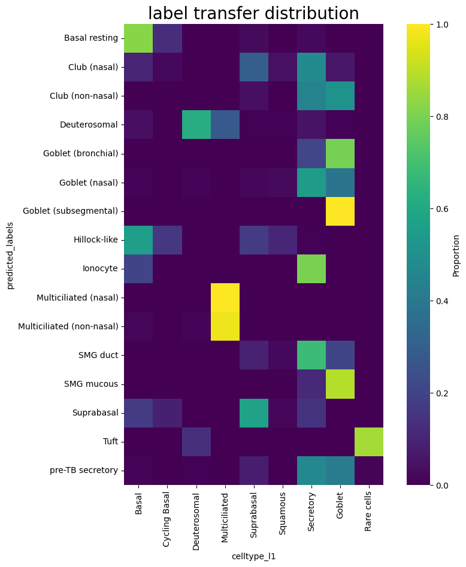

# Single-Cell-Fuzzy-Labels


<!-- WARNING: THIS FILE WAS AUTOGENERATED! DO NOT EDIT! -->


## Install

``` sh
git clone https://github.com/Eamonmca/Single-Cell-Fuzzy-Labels
cd Single-Cell-Fuzzy-Labels
pip install .
```

## How to use

Download pre-embedded data from the cellxgene census or embed your own
data following the insturction of your foundation model of choice - the
embeddings used in this tutorial are from the 33 layer Universal Cell
Embeddings model which we can download for any subset of cells from the
33 million contained within the cellxgene census.

``` python
from Single_Cell_Fuzzy_Labels import census
import scanpy as sc
```

``` python
# reference = census.download_emb(organism='homo_sapiens', tissue='lung', test = True)
reference = sc.read_h5ad('/data/analysis/data_mcandrew/000-sc-UCA-test/uce/HCA_lung_core__uce_adata.h5ad')
```

``` python
reference
```

    AnnData object with n_obs × n_vars = 584944 × 18166
        obs: 'suspension_type', 'donor_id', 'is_primary_data', 'assay_ontology_term_id', 'cell_type_ontology_term_id', 'development_stage_ontology_term_id', 'disease_ontology_term_id', 'self_reported_ethnicity_ontology_term_id', 'tissue_ontology_term_id', 'organism_ontology_term_id', 'sex_ontology_term_id', 'BMI', 'age_or_mean_of_age_range', 'age_range', 'anatomical_region_ccf_score', 'ann_coarse_for_GWAS_and_modeling', 'ann_finest_level', 'ann_level_1', 'ann_level_2', 'ann_level_3', 'ann_level_4', 'ann_level_5', 'cause_of_death', 'dataset', 'entropy_dataset_leiden_3', 'entropy_original_ann_level_1_leiden_3', 'entropy_original_ann_level_2_clean_leiden_3', 'entropy_original_ann_level_3_clean_leiden_3', 'entropy_subject_ID_leiden_3', 'fresh_or_frozen', 'leiden_1', 'leiden_2', 'leiden_3', 'leiden_4', 'leiden_5', 'log10_total_counts', 'lung_condition', 'mixed_ancestry', 'n_genes_detected', 'original_ann_highest_res', 'original_ann_level_1', 'original_ann_level_2', 'original_ann_level_3', 'original_ann_level_4', 'original_ann_level_5', 'original_ann_nonharmonized', 'reannotation_type', 'reference_genome', 'sample', 'scanvi_label', 'sequencing_platform', 'size_factors', 'smoking_status', 'study', 'subject_type', 'tissue_dissociation_protocol', 'tissue_level_2', 'tissue_level_3', 'tissue_sampling_method', 'tissue_type', 'cell_type', 'assay', 'disease', 'organism', 'sex', 'tissue', 'self_reported_ethnicity', 'development_stage', 'observation_joinid', 'n_genes'
        var: 'feature_is_filtered', 'feature_name', 'feature_reference', 'feature_biotype', 'feature_length', 'n_cells'
        uns: 'batch_condition', 'citation', 'default_embedding', 'schema_reference', 'schema_version', 'title'
        obsm: 'X_scanvi_emb', 'X_uce', 'X_umap'
        obsp: 'connectivities', 'distances'

``` python
reference_subset = reference[reference.obs['ann_level_1'] == 'Epithelial']
```

``` python
reference = reference_subset
```

``` python
reference.obsm['X_uce']
```

    ArrayView([[ 0.00750788, -0.04194154,  0.00931572, ...,  0.03899895,
                -0.02080086, -0.01758753],
               [ 0.02603231,  0.03415936, -0.00083805, ...,  0.01040316,
                 0.00231683,  0.07622543],
               [ 0.01907516, -0.03912187,  0.01917193, ...,  0.02607882,
                 0.02887304, -0.00058624],
               ...,
               [ 0.00766119, -0.03144012,  0.00277021, ...,  0.03181685,
                 0.00958184,  0.01409992],
               [-0.0129706 ,  0.04543586, -0.00394633, ..., -0.01092251,
                 0.01244534,  0.01408385],
               [-0.0060271 ,  0.00604395,  0.01479142, ..., -0.00512656,
                -0.01186521,  0.02647699]], dtype=float32)

lets import our query dataset for which we have precomputed the
embedding using the instuction on the UCE github page

Next lets use our well annotated refernece dataset to predict the labels
in our query dataset.

``` python
query = sc.read_h5ad('/data/analysis/data_mcandrew/000-sc-UCA-test/uce/HBECS_ALI28_uce_adata.h5ad')
```

``` python
query
```

    AnnData object with n_obs × n_vars = 10224 × 14949
        obs: 'orig.ident', 'nCount_RNA', 'nFeature_RNA', 'nCount_HTO', 'nFeature_HTO', 'HTO_maxID', 'HTO_secondID', 'HTO_margin', 'HTO_classification', 'HTO_classification.global', 'hash.ID', 'percent.mito', 'percent.ribo', 'dropouts', 'nCount_SCT', 'nFeature_SCT', 'SCT_snn_res.0.4', 'seurat_clusters', 'echantillon', 'donor', 'medium', 'sample', 'type', 'batch', 'type_pred', 'type_uncertainty', 'leiden', 'RNA_snn_res.1', 'cluster_l1', 'celltype_l1', 'ident', 'n_genes'
        var: 'n_cells'
        uns: 'X_name'
        obsm: 'SCANVI', 'UMAP', 'X_uce'
        layers: 'logcounts'

``` python
query.obsm['X_uce']
```

    array([[ 0.0045417 , -0.0086563 ,  0.01687446, ...,  0.02272223,
            -0.01826951, -0.01024585],
           [ 0.01364084, -0.00542254,  0.01779299, ...,  0.01887637,
            -0.00538362,  0.00553044],
           [ 0.00350829,  0.01183089,  0.01040006, ...,  0.01037928,
            -0.01872197, -0.01138068],
           ...,
           [-0.00063122, -0.01984753,  0.02148496, ...,  0.00014579,
             0.01573275, -0.00872346],
           [ 0.00331486, -0.00467246, -0.02007541, ...,  0.01982483,
             0.00755446,  0.00302285],
           [-0.00757075,  0.01373623,  0.01243316, ...,  0.03014414,
            -0.01670015, -0.01620588]], dtype=float32)

``` python
from Single_Cell_Fuzzy_Labels import transfer
```

``` python
predicted_labels = transfer.labels(embedding_array_reference=reference.obsm['X_uce'], 
                          embedding_array_query=query.obsm['X_uce'], 
                          reference_labels=reference.obs['ann_finest_level'], 
                          k=1, 
                          use_gpu=True, 
                          batch_size=None, 
                          distance_metric='L2', 
                          label_consensus='centroid_based', 
                          timed=False)
```

``` python
query.obs['predicted_labels'] = predicted_labels
```

``` python
query.obs['celltype_l1']
```

    Donor1_ALI28_AAACCTGAGCCACCTG       Suprabasal
    Donor1_ALI28_AAACCTGAGCTCAACT            Basal
    Donor1_ALI28_AAACCTGAGTAAGTAC            Basal
    Donor1_ALI28_AAACCTGCAAACCCAT            Basal
    Donor1_ALI28_AAACCTGGTCCTAGCG        Secretory
                                         ...      
    Donor2_ALI28_TTTGTCAGTCATATGC        Secretory
    Donor2_ALI28_TTTGTCAGTCGGGTCT           Goblet
    Donor2_ALI28_TTTGTCAGTTTGTTTC    Cycling Basal
    Donor2_ALI28_TTTGTCATCGTACCGG        Secretory
    Donor2_ALI28_TTTGTCATCTGGCGTG       Suprabasal
    Name: celltype_l1, Length: 10224, dtype: category
    Categories (9, object): ['Basal', 'Cycling Basal', 'Deuterosomal', 'Multiciliated', ..., 'Squamous', 'Secretory', 'Goblet', 'Rare cells']

``` python
predicted_labels
```

    ['Basal resting',
     'Basal resting',
     'Club (nasal)',
     'Basal resting',
     'Club (non-nasal)',
     'Goblet (nasal)',
     'Club (nasal)',
     'Suprabasal',
     'Basal resting',
     'Club (nasal)',
     'Basal resting',
     'Basal resting',
     'Basal resting',
     'Goblet (nasal)',
     'Suprabasal',
     'Basal resting',
     'Club (nasal)',
     'Club (non-nasal)',
     'Basal resting',
     'Club (nasal)',
     'Deuterosomal',
     'Basal resting',
     'Basal resting',
     'Club (non-nasal)',
     'Club (nasal)',
     'Goblet (nasal)',
     'Club (non-nasal)',
     'Basal resting',
     'Club (nasal)',
     'Basal resting',
     'Club (non-nasal)',
     'Basal resting',
     'Goblet (nasal)',
     'Suprabasal',
     'Club (nasal)',
     'Club (non-nasal)',
     'Basal resting',
     'Basal resting',
     'Club (nasal)',
     'Club (nasal)',
     'Goblet (nasal)',
     'Club (nasal)',
     'Suprabasal',
     'Club (non-nasal)',
     'Basal resting',
     'Club (nasal)',
     'Deuterosomal',
     'Basal resting',
     'Multiciliated (non-nasal)',
     'Club (non-nasal)',
     'Club (nasal)',
     'Multiciliated (non-nasal)',
     'Club (nasal)',
     'Basal resting',
     'Suprabasal',
     'Club (nasal)',
     'Club (nasal)',
     'Goblet (nasal)',
     'Basal resting',
     'Club (non-nasal)',
     'Multiciliated (non-nasal)',
     'Club (non-nasal)',
     'Club (nasal)',
     'Suprabasal',
     'Club (nasal)',
     'Club (non-nasal)',
     'Club (non-nasal)',
     'Club (nasal)',
     'Club (nasal)',
     'Basal resting',
     'Club (nasal)',
     'Club (nasal)',
     'Club (nasal)',
     'Basal resting',
     'Club (nasal)',
     'Club (nasal)',
     'Club (non-nasal)',
     'Multiciliated (non-nasal)',
     'Basal resting',
     'Basal resting',
     'Basal resting',
     'Goblet (nasal)',
     'Basal resting',
     'Club (nasal)',
     'Basal resting',
     'Club (nasal)',
     'Basal resting',
     'Goblet (nasal)',
     'Multiciliated (non-nasal)',
     'Club (non-nasal)',
     'Multiciliated (non-nasal)',
     'Basal resting',
     'Club (non-nasal)',
     'Basal resting',
     'Hillock-like',
     'Club (non-nasal)',
     'Goblet (nasal)',
     'Club (nasal)',
     'Basal resting',
     'Goblet (nasal)',
     'Suprabasal',
     'Club (non-nasal)',
     'Club (nasal)',
     'Goblet (nasal)',
     'Goblet (nasal)',
     'Club (non-nasal)',
     'Multiciliated (non-nasal)',
     'Club (nasal)',
     'Basal resting',
     'Basal resting',
     'Club (non-nasal)',
     'Club (non-nasal)',
     'Suprabasal',
     'Basal resting',
     'Basal resting',
     'Basal resting',
     'Club (non-nasal)',
     'Club (non-nasal)',
     'Club (non-nasal)',
     'Goblet (nasal)',
     'Basal resting',
     'Club (non-nasal)',
     'Goblet (nasal)',
     'Club (nasal)',
     'Goblet (nasal)',
     'Club (non-nasal)',
     'Basal resting',
     'Hillock-like',
     'Club (non-nasal)',
     'Suprabasal',
     'Basal resting',
     'Club (nasal)',
     'Suprabasal',
     'Club (non-nasal)',
     'Club (nasal)',
     'Hillock-like',
     'Club (non-nasal)',
     'Club (nasal)',
     'Club (nasal)',
     'Basal resting',
     'Club (nasal)',
     'Club (nasal)',
     'Suprabasal',
     'Club (non-nasal)',
     'Goblet (nasal)',
     'Suprabasal',
     'Club (non-nasal)',
     'Basal resting',
     'Club (nasal)',
     'Club (nasal)',
     'Suprabasal',
     'Club (non-nasal)',
     'pre-TB secretory',
     'Goblet (nasal)',
     'Club (nasal)',
     'Club (non-nasal)',
     'Goblet (nasal)',
     'Suprabasal',
     'Basal resting',
     'Suprabasal',
     'Basal resting',
     'Club (non-nasal)',
     'Deuterosomal',
     'pre-TB secretory',
     'Goblet (nasal)',
     'Club (nasal)',
     'Hillock-like',
     'Basal resting',
     'Suprabasal',
     'Club (nasal)',
     'Basal resting',
     'Goblet (nasal)',
     'Club (nasal)',
     'Club (non-nasal)',
     'Club (nasal)',
     'Club (non-nasal)',
     'Club (non-nasal)',
     'Basal resting',
     'pre-TB secretory',
     'Club (nasal)',
     'Club (non-nasal)',
     'Club (nasal)',
     'Club (non-nasal)',
     'Club (nasal)',
     'Goblet (nasal)',
     'pre-TB secretory',
     'Club (nasal)',
     'Club (non-nasal)',
     'Multiciliated (non-nasal)',
     'Club (non-nasal)',
     'Club (non-nasal)',
     'Club (nasal)',
     'Goblet (nasal)',
     'Club (non-nasal)',
     'Multiciliated (non-nasal)',
     'Basal resting',
     'Club (nasal)',
     'Basal resting',
     'Basal resting',
     'Basal resting',
     'Club (non-nasal)',
     'Club (non-nasal)',
     'Club (nasal)',
     'Club (non-nasal)',
     'Club (nasal)',
     'Basal resting',
     'Club (nasal)',
     'Club (nasal)',
     'Club (nasal)',
     'Club (nasal)',
     'Club (nasal)',
     'Goblet (nasal)',
     'Basal resting',
     'Basal resting',
     'Basal resting',
     'Basal resting',
     'Club (nasal)',
     'Goblet (nasal)',
     'Goblet (nasal)',
     'Club (non-nasal)',
     'Club (non-nasal)',
     'Goblet (nasal)',
     'Club (nasal)',
     'Goblet (nasal)',
     'Club (non-nasal)',
     'Club (nasal)',
     'Club (nasal)',
     'Basal resting',
     'Club (non-nasal)',
     'Goblet (nasal)',
     'Basal resting',
     'Deuterosomal',
     'Club (nasal)',
     'Basal resting',
     'Goblet (nasal)',
     'Basal resting',
     'Basal resting',
     'Hillock-like',
     'Suprabasal',
     'Basal resting',
     'Club (non-nasal)',
     'Club (nasal)',
     'Basal resting',
     'Club (nasal)',
     'Club (non-nasal)',
     'Multiciliated (non-nasal)',
     'Basal resting',
     'Club (nasal)',
     'Basal resting',
     'Basal resting',
     'Goblet (nasal)',
     'Club (non-nasal)',
     'Basal resting',
     'Club (nasal)',
     'Club (non-nasal)',
     'Club (nasal)',
     'Basal resting',
     'Basal resting',
     'Club (nasal)',
     'Club (nasal)',
     'Club (nasal)',
     'Basal resting',
     'Club (non-nasal)',
     'Basal resting',
     'Basal resting',
     'Basal resting',
     'Club (nasal)',
     'Goblet (nasal)',
     'Club (non-nasal)',
     'Club (nasal)',
     'Basal resting',
     'Club (non-nasal)',
     'Club (nasal)',
     'Basal resting',
     'Basal resting',
     'Basal resting',
     'Goblet (nasal)',
     'Basal resting',
     'Suprabasal',
     'Club (non-nasal)',
     'Basal resting',
     'Club (non-nasal)',
     'Club (nasal)',
     'Multiciliated (non-nasal)',
     'Club (nasal)',
     'Suprabasal',
     'Goblet (nasal)',
     'Club (nasal)',
     'Basal resting',
     'Basal resting',
     'Suprabasal',
     'Basal resting',
     'Basal resting',
     'Suprabasal',
     'Club (nasal)',
     'Goblet (nasal)',
     'Basal resting',
     'Club (nasal)',
     'pre-TB secretory',
     'Club (non-nasal)',
     'Club (nasal)',
     'Basal resting',
     'Club (nasal)',
     'Goblet (nasal)',
     'Club (nasal)',
     'Club (non-nasal)',
     'pre-TB secretory',
     'Basal resting',
     'Club (nasal)',
     'Basal resting',
     'Suprabasal',
     'Club (nasal)',
     'Club (nasal)',
     'Basal resting',
     'Club (non-nasal)',
     'Club (nasal)',
     'Goblet (nasal)',
     'Hillock-like',
     'Goblet (nasal)',
     'Goblet (nasal)',
     'Goblet (nasal)',
     'Basal resting',
     'Club (nasal)',
     'Club (non-nasal)',
     'Basal resting',
     'Goblet (nasal)',
     'Club (nasal)',
     'Club (nasal)',
     'Club (non-nasal)',
     'Suprabasal',
     'Goblet (nasal)',
     'Basal resting',
     'Goblet (nasal)',
     'Club (nasal)',
     'Club (nasal)',
     'Basal resting',
     'Club (non-nasal)',
     'Basal resting',
     'Club (nasal)',
     'Goblet (nasal)',
     'Basal resting',
     'Basal resting',
     'Suprabasal',
     'Basal resting',
     'Club (non-nasal)',
     'Suprabasal',
     'Basal resting',
     'Basal resting',
     'Club (non-nasal)',
     'Club (nasal)',
     'Club (nasal)',
     'Suprabasal',
     'Basal resting',
     'Basal resting',
     'Basal resting',
     'Goblet (nasal)',
     'Club (non-nasal)',
     'Basal resting',
     'Basal resting',
     'Basal resting',
     'Club (non-nasal)',
     'Club (non-nasal)',
     'Basal resting',
     'Club (non-nasal)',
     'Club (non-nasal)',
     'Multiciliated (non-nasal)',
     'Club (nasal)',
     'Suprabasal',
     'Basal resting',
     'Basal resting',
     'Club (nasal)',
     'Club (non-nasal)',
     'Club (non-nasal)',
     'pre-TB secretory',
     'Club (non-nasal)',
     'Club (nasal)',
     'Basal resting',
     'Basal resting',
     'Hillock-like',
     'Multiciliated (non-nasal)',
     'Suprabasal',
     'Club (nasal)',
     'Club (nasal)',
     'Basal resting',
     'Multiciliated (non-nasal)',
     'Goblet (nasal)',
     'Club (non-nasal)',
     'Hillock-like',
     'Goblet (nasal)',
     'Goblet (nasal)',
     'Club (nasal)',
     'Multiciliated (non-nasal)',
     'Club (nasal)',
     'Club (non-nasal)',
     'Club (non-nasal)',
     'Club (non-nasal)',
     'Club (nasal)',
     'Suprabasal',
     'Basal resting',
     'Club (non-nasal)',
     'Club (nasal)',
     'Club (non-nasal)',
     'Club (nasal)',
     'Club (nasal)',
     'Basal resting',
     'Basal resting',
     'Basal resting',
     'Basal resting',
     'Basal resting',
     'Club (nasal)',
     'Goblet (nasal)',
     'Deuterosomal',
     'Club (non-nasal)',
     'Club (nasal)',
     'Basal resting',
     'Goblet (nasal)',
     'Goblet (nasal)',
     'Club (nasal)',
     'Club (non-nasal)',
     'Basal resting',
     'Goblet (nasal)',
     'Hillock-like',
     'Club (nasal)',
     'Club (non-nasal)',
     'Suprabasal',
     'Basal resting',
     'Goblet (nasal)',
     'Club (nasal)',
     'Club (non-nasal)',
     'Basal resting',
     'Club (nasal)',
     'Club (non-nasal)',
     'Club (nasal)',
     'Club (nasal)',
     'Goblet (nasal)',
     'Club (nasal)',
     'Club (non-nasal)',
     'Multiciliated (non-nasal)',
     'Basal resting',
     'Club (nasal)',
     'Club (nasal)',
     'Basal resting',
     'Club (nasal)',
     'Club (non-nasal)',
     'Club (non-nasal)',
     'Goblet (nasal)',
     'Goblet (nasal)',
     'Basal resting',
     'SMG mucous',
     'Basal resting',
     'Basal resting',
     'Club (non-nasal)',
     'Basal resting',
     'Suprabasal',
     'Basal resting',
     'Multiciliated (non-nasal)',
     'Basal resting',
     'Club (nasal)',
     'Club (non-nasal)',
     'Basal resting',
     'Club (nasal)',
     'Club (non-nasal)',
     'Club (nasal)',
     'Club (non-nasal)',
     'Basal resting',
     'Club (nasal)',
     'Basal resting',
     'Club (nasal)',
     'Club (nasal)',
     'Club (nasal)',
     'Goblet (nasal)',
     'Club (non-nasal)',
     'Basal resting',
     'Basal resting',
     'Goblet (nasal)',
     'Hillock-like',
     'Club (non-nasal)',
     'Club (nasal)',
     'Club (nasal)',
     'Club (nasal)',
     'Goblet (nasal)',
     'Goblet (nasal)',
     'Suprabasal',
     'Club (non-nasal)',
     'Club (nasal)',
     'Suprabasal',
     'Club (non-nasal)',
     'Basal resting',
     'Basal resting',
     'Basal resting',
     'Club (nasal)',
     'Club (nasal)',
     'Multiciliated (non-nasal)',
     'Club (nasal)',
     'Club (non-nasal)',
     'Hillock-like',
     'Basal resting',
     'Basal resting',
     'Club (nasal)',
     'Basal resting',
     'Goblet (nasal)',
     'Basal resting',
     'Club (nasal)',
     'Basal resting',
     'Club (non-nasal)',
     'pre-TB secretory',
     'Club (nasal)',
     'Basal resting',
     'Club (nasal)',
     'Club (non-nasal)',
     'Basal resting',
     'Club (non-nasal)',
     'Club (nasal)',
     'Suprabasal',
     'Club (non-nasal)',
     'Basal resting',
     'Club (non-nasal)',
     'Basal resting',
     'Basal resting',
     'Basal resting',
     'Basal resting',
     'Club (nasal)',
     'Club (non-nasal)',
     'Club (nasal)',
     'Club (nasal)',
     'Multiciliated (non-nasal)',
     'Basal resting',
     'Club (nasal)',
     'Club (nasal)',
     'Club (nasal)',
     'Goblet (nasal)',
     'Suprabasal',
     'Club (non-nasal)',
     'Club (nasal)',
     'Goblet (nasal)',
     'Club (non-nasal)',
     'Basal resting',
     'Basal resting',
     'Club (nasal)',
     'Hillock-like',
     'Basal resting',
     'Club (nasal)',
     'Club (nasal)',
     'Multiciliated (non-nasal)',
     'Club (non-nasal)',
     'Basal resting',
     'Basal resting',
     'Multiciliated (non-nasal)',
     'Suprabasal',
     'Goblet (nasal)',
     'Club (non-nasal)',
     'Club (nasal)',
     'Multiciliated (non-nasal)',
     'Goblet (nasal)',
     'Club (nasal)',
     'Club (nasal)',
     'Goblet (nasal)',
     'Goblet (nasal)',
     'Deuterosomal',
     'Basal resting',
     'Goblet (nasal)',
     'Multiciliated (non-nasal)',
     'Club (nasal)',
     'Goblet (nasal)',
     'Club (non-nasal)',
     'Hillock-like',
     'Club (nasal)',
     'Suprabasal',
     'Club (non-nasal)',
     'Hillock-like',
     'Basal resting',
     'Club (nasal)',
     'Club (non-nasal)',
     'Club (non-nasal)',
     'pre-TB secretory',
     'Club (non-nasal)',
     'Club (non-nasal)',
     'Club (nasal)',
     'Basal resting',
     'Club (non-nasal)',
     'Goblet (nasal)',
     'Club (non-nasal)',
     'Club (non-nasal)',
     'Basal resting',
     'Club (nasal)',
     'Basal resting',
     'Suprabasal',
     'Club (non-nasal)',
     'Basal resting',
     'Club (nasal)',
     'Goblet (nasal)',
     'Club (nasal)',
     'Basal resting',
     'Club (non-nasal)',
     'Club (non-nasal)',
     'Goblet (nasal)',
     'Suprabasal',
     'Basal resting',
     'Suprabasal',
     'Club (non-nasal)',
     'Basal resting',
     'Club (nasal)',
     'Basal resting',
     'Goblet (nasal)',
     'Goblet (nasal)',
     'Hillock-like',
     'Club (non-nasal)',
     'Goblet (nasal)',
     'Basal resting',
     'Club (nasal)',
     'Hillock-like',
     'Basal resting',
     'Multiciliated (non-nasal)',
     'Club (nasal)',
     'Club (non-nasal)',
     'Club (nasal)',
     'Club (nasal)',
     'Club (nasal)',
     'Goblet (nasal)',
     'Club (non-nasal)',
     'Goblet (nasal)',
     'Club (nasal)',
     'Goblet (nasal)',
     'Club (non-nasal)',
     'Club (nasal)',
     'Club (nasal)',
     'Tuft',
     'Club (non-nasal)',
     'Club (nasal)',
     'Goblet (nasal)',
     'Basal resting',
     'Basal resting',
     'Club (nasal)',
     'Goblet (nasal)',
     'Basal resting',
     'Goblet (nasal)',
     'Club (non-nasal)',
     'Basal resting',
     'Club (nasal)',
     'Goblet (nasal)',
     'Suprabasal',
     'Club (nasal)',
     'Suprabasal',
     'Basal resting',
     'Suprabasal',
     'Deuterosomal',
     'Basal resting',
     'Basal resting',
     'Club (nasal)',
     'Club (non-nasal)',
     'Hillock-like',
     'Basal resting',
     'Club (non-nasal)',
     'Goblet (nasal)',
     'Basal resting',
     'Multiciliated (non-nasal)',
     'Hillock-like',
     'Basal resting',
     'Basal resting',
     'Club (non-nasal)',
     'Basal resting',
     'Club (nasal)',
     'Goblet (nasal)',
     'Basal resting',
     'Club (nasal)',
     'Club (nasal)',
     'Deuterosomal',
     'Club (non-nasal)',
     'Basal resting',
     'Club (nasal)',
     'Goblet (nasal)',
     'Deuterosomal',
     'Basal resting',
     'Basal resting',
     'Hillock-like',
     'Club (nasal)',
     'Club (nasal)',
     'Basal resting',
     'Basal resting',
     'Club (non-nasal)',
     'Basal resting',
     'Basal resting',
     'Basal resting',
     'Club (non-nasal)',
     'Hillock-like',
     'Club (nasal)',
     'Basal resting',
     'Goblet (nasal)',
     'Club (nasal)',
     'Club (nasal)',
     'Club (non-nasal)',
     'pre-TB secretory',
     'Suprabasal',
     'Club (nasal)',
     'Club (nasal)',
     'Goblet (nasal)',
     'Club (nasal)',
     'Club (nasal)',
     'Club (nasal)',
     'Club (nasal)',
     'Club (non-nasal)',
     'Club (nasal)',
     'Suprabasal',
     'Club (non-nasal)',
     'Hillock-like',
     'Goblet (nasal)',
     'Club (non-nasal)',
     'Suprabasal',
     'Basal resting',
     'Basal resting',
     'Club (non-nasal)',
     'Suprabasal',
     'Basal resting',
     'Club (nasal)',
     'Basal resting',
     'Club (nasal)',
     'Suprabasal',
     'Basal resting',
     'Deuterosomal',
     'Basal resting',
     'Goblet (nasal)',
     'Basal resting',
     'Club (nasal)',
     'Suprabasal',
     'Deuterosomal',
     'Goblet (nasal)',
     'Club (nasal)',
     'Basal resting',
     'Club (nasal)',
     'Club (non-nasal)',
     'Club (nasal)',
     'Club (non-nasal)',
     'Goblet (nasal)',
     'Basal resting',
     'Club (nasal)',
     'Club (non-nasal)',
     'Club (non-nasal)',
     'Suprabasal',
     'Goblet (nasal)',
     'Basal resting',
     'Basal resting',
     'Basal resting',
     'Basal resting',
     'Basal resting',
     'Basal resting',
     'Club (nasal)',
     'pre-TB secretory',
     'Club (nasal)',
     'Basal resting',
     'Club (non-nasal)',
     'Club (non-nasal)',
     'Multiciliated (non-nasal)',
     'Suprabasal',
     'Multiciliated (non-nasal)',
     'Goblet (nasal)',
     'Suprabasal',
     'Club (nasal)',
     'Basal resting',
     'Basal resting',
     'Club (nasal)',
     'Goblet (nasal)',
     'Goblet (nasal)',
     'Basal resting',
     'Basal resting',
     'Club (nasal)',
     'Club (non-nasal)',
     'Basal resting',
     'Club (non-nasal)',
     'Club (non-nasal)',
     'Basal resting',
     'Basal resting',
     'Club (non-nasal)',
     'Club (nasal)',
     'Club (non-nasal)',
     'Club (nasal)',
     'Club (nasal)',
     'Multiciliated (non-nasal)',
     'Goblet (nasal)',
     'Club (non-nasal)',
     'Basal resting',
     'Club (non-nasal)',
     'Club (non-nasal)',
     'Goblet (nasal)',
     'Club (nasal)',
     'Basal resting',
     'Goblet (nasal)',
     'Club (non-nasal)',
     'Club (non-nasal)',
     'Club (nasal)',
     'Club (non-nasal)',
     'Club (non-nasal)',
     'Basal resting',
     'Basal resting',
     'Club (non-nasal)',
     'Club (non-nasal)',
     'Basal resting',
     'Basal resting',
     'Hillock-like',
     'Hillock-like',
     'Club (non-nasal)',
     'Basal resting',
     'Hillock-like',
     'Club (nasal)',
     'Club (nasal)',
     'Club (nasal)',
     'Club (non-nasal)',
     'Goblet (nasal)',
     'Club (non-nasal)',
     'Suprabasal',
     'Club (non-nasal)',
     'Basal resting',
     'Multiciliated (non-nasal)',
     'Basal resting',
     'Goblet (nasal)',
     'Club (non-nasal)',
     'Club (non-nasal)',
     'Club (nasal)',
     'Club (non-nasal)',
     'Club (nasal)',
     'Basal resting',
     'Club (nasal)',
     'Club (nasal)',
     'Hillock-like',
     'Club (nasal)',
     'Goblet (nasal)',
     'Club (non-nasal)',
     'Multiciliated (non-nasal)',
     'Hillock-like',
     'Basal resting',
     'Basal resting',
     'Club (nasal)',
     'Club (non-nasal)',
     'Club (non-nasal)',
     'Basal resting',
     'Club (non-nasal)',
     'Basal resting',
     'Club (nasal)',
     'Club (non-nasal)',
     'Goblet (nasal)',
     'Basal resting',
     'Club (nasal)',
     'Club (nasal)',
     'Basal resting',
     'Basal resting',
     'Basal resting',
     'Club (non-nasal)',
     'Goblet (nasal)',
     'Club (nasal)',
     'Goblet (nasal)',
     'Club (nasal)',
     'Club (nasal)',
     'Club (nasal)',
     'Club (non-nasal)',
     'Club (nasal)',
     'Basal resting',
     'Basal resting',
     'Basal resting',
     'Club (nasal)',
     'Club (nasal)',
     'Basal resting',
     'Club (non-nasal)',
     'Goblet (nasal)',
     'Multiciliated (non-nasal)',
     'Club (non-nasal)',
     'Club (nasal)',
     'Basal resting',
     'Basal resting',
     'Club (non-nasal)',
     'Basal resting',
     'Club (nasal)',
     'Goblet (nasal)',
     'Multiciliated (non-nasal)',
     'Club (non-nasal)',
     'Basal resting',
     'Goblet (nasal)',
     'Club (non-nasal)',
     'pre-TB secretory',
     'Multiciliated (non-nasal)',
     'Club (nasal)',
     'Club (nasal)',
     'Basal resting',
     'pre-TB secretory',
     'Club (nasal)',
     'Club (non-nasal)',
     'Club (non-nasal)',
     'Club (nasal)',
     'pre-TB secretory',
     'Goblet (nasal)',
     'Club (nasal)',
     'Basal resting',
     'Club (nasal)',
     'Club (non-nasal)',
     'Club (nasal)',
     'Club (non-nasal)',
     'Club (non-nasal)',
     'Club (non-nasal)',
     'Club (nasal)',
     'Club (non-nasal)',
     'Club (nasal)',
     'Multiciliated (non-nasal)',
     'Goblet (nasal)',
     'Basal resting',
     'Suprabasal',
     'Club (nasal)',
     'Suprabasal',
     'Club (nasal)',
     'pre-TB secretory',
     'Club (non-nasal)',
     'Club (nasal)',
     'Multiciliated (non-nasal)',
     'Goblet (nasal)',
     'Club (non-nasal)',
     'Basal resting',
     'Club (nasal)',
     'Club (non-nasal)',
     'Basal resting',
     'Club (nasal)',
     'Basal resting',
     'Club (non-nasal)',
     'Club (nasal)',
     'Club (nasal)',
     'Club (non-nasal)',
     'Club (nasal)',
     'Suprabasal',
     'Basal resting',
     'Basal resting',
     'Hillock-like',
     'Goblet (nasal)',
     'Club (non-nasal)',
     'Club (nasal)',
     'Basal resting',
     'Basal resting',
     'Deuterosomal',
     'Club (nasal)',
     'Basal resting',
     'Club (nasal)',
     'Club (nasal)',
     'Basal resting',
     'Club (nasal)',
     'Club (nasal)',
     'Goblet (nasal)',
     'Basal resting',
     'Goblet (nasal)',
     'Suprabasal',
     'Basal resting',
     'Club (non-nasal)',
     'Basal resting',
     'Club (nasal)',
     'Club (nasal)',
     'Club (nasal)',
     'Hillock-like',
     'Basal resting',
     'Suprabasal',
     'Club (non-nasal)',
     'Club (non-nasal)',
     'Basal resting',
     'Basal resting',
     'Club (non-nasal)',
     'Club (non-nasal)',
     'Goblet (nasal)',
     'Basal resting',
     'Goblet (nasal)',
     'Goblet (nasal)',
     'Club (nasal)',
     'Club (nasal)',
     'Club (nasal)',
     'Basal resting',
     'Goblet (nasal)',
     'Club (non-nasal)',
     'Club (non-nasal)',
     'Basal resting',
     'Club (non-nasal)',
     'Club (non-nasal)',
     'Basal resting',
     'Deuterosomal',
     'Goblet (nasal)',
     'Club (non-nasal)',
     'Suprabasal',
     'Club (nasal)',
     'Basal resting',
     'Goblet (nasal)',
     'Club (non-nasal)',
     'Goblet (nasal)',
     'Deuterosomal',
     'Club (nasal)',
     'Multiciliated (non-nasal)',
     'Basal resting',
     'Club (non-nasal)',
     'Hillock-like',
     'Club (nasal)',
     'Goblet (nasal)',
     'Goblet (nasal)',
     'Basal resting',
     'Club (nasal)',
     'Basal resting',
     'Club (nasal)',
     'Basal resting',
     'Club (nasal)',
     'Hillock-like',
     'Club (nasal)',
     ...]

``` python
from Single_Cell_Fuzzy_Labels import viz
```

``` python
transfers = viz.map_label_transfers(query, 'predicted_labels', 'celltype_l1')
```

    /home/mcandrew/.conda/envs/fuzz/lib/python3.9/site-packages/Single_Cell_Fuzzy_Labels/viz.py:29: FutureWarning: The default of observed=False is deprecated and will be changed to True in a future version of pandas. Pass observed=False to retain current behavior or observed=True to adopt the future default and silence this warning.
      df = query_dataset.obs.groupby([reference_label, predicted_query_label])[reference_label].count().unstack().fillna(0).astype(int)

``` python
print(transfers)
```

    celltype_l1                   Basal  Cycling Basal  Deuterosomal  \
    predicted_labels                                                   
    Basal resting              0.823691       0.125148      0.000000   
    Club (nasal)               0.100762       0.021675      0.002343   
    Club (non-nasal)           0.003484       0.000581      0.002904   
    Deuterosomal               0.037838       0.000000      0.621622   
    Goblet (bronchial)         0.000000       0.000000      0.000000   
    Goblet (nasal)             0.011701       0.000900      0.009901   
    Goblet (subsegmental)      0.000000       0.000000      0.000000   
    Hillock-like               0.555556       0.157233      0.000000   
    Ionocyte                   0.200000       0.000000      0.000000   
    Multiciliated (nasal)      0.000000       0.000000      0.000000   
    Multiciliated (non-nasal)  0.012500       0.000000      0.011538   
    SMG duct                   0.000000       0.000000      0.000000   
    SMG mucous                 0.000000       0.000000      0.000000   
    Suprabasal                 0.174881       0.087440      0.000000   
    Tuft                       0.000000       0.000000      0.133333   
    pre-TB secretory           0.011348       0.002837      0.005674   

    celltype_l1                Multiciliated  Suprabasal  Squamous  Secretory  \
    predicted_labels                                                            
    Basal resting                   0.001574    0.027155  0.000394   0.020071   
    Club (nasal)                    0.000000    0.295841  0.042765   0.473345   
    Club (non-nasal)                0.000000    0.035424  0.001161   0.448897   
    Deuterosomal                    0.275676    0.005405  0.005405   0.048649   
    Goblet (bronchial)              0.000000    0.000000  0.000000   0.208333   
    Goblet (nasal)                  0.000900    0.016202  0.027003   0.549055   
    Goblet (subsegmental)           0.000000    0.000000  0.000000   0.000000   
    Hillock-like                    0.000000    0.174004  0.109015   0.004193   
    Ionocyte                        0.000000    0.000000  0.000000   0.800000   
    Multiciliated (nasal)           1.000000    0.000000  0.000000   0.000000   
    Multiciliated (non-nasal)       0.975962    0.000000  0.000000   0.000000   
    SMG duct                        0.000000    0.090909  0.022727   0.681818   
    SMG mucous                      0.000000    0.000000  0.000000   0.111111   
    Suprabasal                      0.000000    0.577107  0.015898   0.144674   
    Tuft                            0.000000    0.000000  0.000000   0.000000   
    pre-TB secretory                0.002837    0.080851  0.001418   0.472340   

    celltype_l1                  Goblet  Rare cells  
    predicted_labels                                 
    Basal resting              0.001181    0.000787  
    Club (nasal)               0.060340    0.002929  
    Club (non-nasal)           0.505807    0.001742  
    Deuterosomal               0.005405    0.000000  
    Goblet (bronchial)         0.791667    0.000000  
    Goblet (nasal)             0.384338    0.000000  
    Goblet (subsegmental)      1.000000    0.000000  
    Hillock-like               0.000000    0.000000  
    Ionocyte                   0.000000    0.000000  
    Multiciliated (nasal)      0.000000    0.000000  
    Multiciliated (non-nasal)  0.000000    0.000000  
    SMG duct                   0.204545    0.000000  
    SMG mucous                 0.888889    0.000000  
    Suprabasal                 0.000000    0.000000  
    Tuft                       0.000000    0.866667  
    pre-TB secretory           0.411348    0.011348  

``` python
viz.visualize_label_distribution(transfers, fuzz1_score=None, title='label transfer distribution')
```



``` python
from Single_Cell_Fuzzy_Labels import harmonise 
from dotenv import load_dotenv
load_dotenv()
```

    True

``` python
Label_alias_dict = harmonise.match_cell_labels(list(query.obs['celltype_l1'].values.unique()), list(query.obs['predicted_labels'].unique()))
```

``` python
query.obs['celltype_l1'].unique()
```

    ['Suprabasal', 'Basal', 'Secretory', 'Goblet', 'Deuterosomal', 'Multiciliated', 'Cycling Basal', 'Squamous', 'Rare cells']
    Categories (9, object): ['Basal', 'Cycling Basal', 'Deuterosomal', 'Multiciliated', ..., 'Squamous', 'Secretory', 'Goblet', 'Rare cells']

``` python
list(query.obs['predicted_labels'].values)
```

    ['Basal resting',
     'Basal resting',
     'Club (nasal)',
     'Basal resting',
     'Club (non-nasal)',
     'Goblet (nasal)',
     'Club (nasal)',
     'Suprabasal',
     'Basal resting',
     'Club (nasal)',
     'Basal resting',
     'Basal resting',
     'Basal resting',
     'Goblet (nasal)',
     'Suprabasal',
     'Basal resting',
     'Club (nasal)',
     'Club (non-nasal)',
     'Basal resting',
     'Club (nasal)',
     'Deuterosomal',
     'Basal resting',
     'Basal resting',
     'Club (non-nasal)',
     'Club (nasal)',
     'Goblet (nasal)',
     'Club (non-nasal)',
     'Basal resting',
     'Club (nasal)',
     'Basal resting',
     'Club (non-nasal)',
     'Basal resting',
     'Goblet (nasal)',
     'Suprabasal',
     'Club (nasal)',
     'Club (non-nasal)',
     'Basal resting',
     'Basal resting',
     'Club (nasal)',
     'Club (nasal)',
     'Goblet (nasal)',
     'Club (nasal)',
     'Suprabasal',
     'Club (non-nasal)',
     'Basal resting',
     'Club (nasal)',
     'Deuterosomal',
     'Basal resting',
     'Multiciliated (non-nasal)',
     'Club (non-nasal)',
     'Club (nasal)',
     'Multiciliated (non-nasal)',
     'Club (nasal)',
     'Basal resting',
     'Suprabasal',
     'Club (nasal)',
     'Club (nasal)',
     'Goblet (nasal)',
     'Basal resting',
     'Club (non-nasal)',
     'Multiciliated (non-nasal)',
     'Club (non-nasal)',
     'Club (nasal)',
     'Suprabasal',
     'Club (nasal)',
     'Club (non-nasal)',
     'Club (non-nasal)',
     'Club (nasal)',
     'Club (nasal)',
     'Basal resting',
     'Club (nasal)',
     'Club (nasal)',
     'Club (nasal)',
     'Basal resting',
     'Club (nasal)',
     'Club (nasal)',
     'Club (non-nasal)',
     'Multiciliated (non-nasal)',
     'Basal resting',
     'Basal resting',
     'Basal resting',
     'Goblet (nasal)',
     'Basal resting',
     'Club (nasal)',
     'Basal resting',
     'Club (nasal)',
     'Basal resting',
     'Goblet (nasal)',
     'Multiciliated (non-nasal)',
     'Club (non-nasal)',
     'Multiciliated (non-nasal)',
     'Basal resting',
     'Club (non-nasal)',
     'Basal resting',
     'Hillock-like',
     'Club (non-nasal)',
     'Goblet (nasal)',
     'Club (nasal)',
     'Basal resting',
     'Goblet (nasal)',
     'Suprabasal',
     'Club (non-nasal)',
     'Club (nasal)',
     'Goblet (nasal)',
     'Goblet (nasal)',
     'Club (non-nasal)',
     'Multiciliated (non-nasal)',
     'Club (nasal)',
     'Basal resting',
     'Basal resting',
     'Club (non-nasal)',
     'Club (non-nasal)',
     'Suprabasal',
     'Basal resting',
     'Basal resting',
     'Basal resting',
     'Club (non-nasal)',
     'Club (non-nasal)',
     'Club (non-nasal)',
     'Goblet (nasal)',
     'Basal resting',
     'Club (non-nasal)',
     'Goblet (nasal)',
     'Club (nasal)',
     'Goblet (nasal)',
     'Club (non-nasal)',
     'Basal resting',
     'Hillock-like',
     'Club (non-nasal)',
     'Suprabasal',
     'Basal resting',
     'Club (nasal)',
     'Suprabasal',
     'Club (non-nasal)',
     'Club (nasal)',
     'Hillock-like',
     'Club (non-nasal)',
     'Club (nasal)',
     'Club (nasal)',
     'Basal resting',
     'Club (nasal)',
     'Club (nasal)',
     'Suprabasal',
     'Club (non-nasal)',
     'Goblet (nasal)',
     'Suprabasal',
     'Club (non-nasal)',
     'Basal resting',
     'Club (nasal)',
     'Club (nasal)',
     'Suprabasal',
     'Club (non-nasal)',
     'pre-TB secretory',
     'Goblet (nasal)',
     'Club (nasal)',
     'Club (non-nasal)',
     'Goblet (nasal)',
     'Suprabasal',
     'Basal resting',
     'Suprabasal',
     'Basal resting',
     'Club (non-nasal)',
     'Deuterosomal',
     'pre-TB secretory',
     'Goblet (nasal)',
     'Club (nasal)',
     'Hillock-like',
     'Basal resting',
     'Suprabasal',
     'Club (nasal)',
     'Basal resting',
     'Goblet (nasal)',
     'Club (nasal)',
     'Club (non-nasal)',
     'Club (nasal)',
     'Club (non-nasal)',
     'Club (non-nasal)',
     'Basal resting',
     'pre-TB secretory',
     'Club (nasal)',
     'Club (non-nasal)',
     'Club (nasal)',
     'Club (non-nasal)',
     'Club (nasal)',
     'Goblet (nasal)',
     'pre-TB secretory',
     'Club (nasal)',
     'Club (non-nasal)',
     'Multiciliated (non-nasal)',
     'Club (non-nasal)',
     'Club (non-nasal)',
     'Club (nasal)',
     'Goblet (nasal)',
     'Club (non-nasal)',
     'Multiciliated (non-nasal)',
     'Basal resting',
     'Club (nasal)',
     'Basal resting',
     'Basal resting',
     'Basal resting',
     'Club (non-nasal)',
     'Club (non-nasal)',
     'Club (nasal)',
     'Club (non-nasal)',
     'Club (nasal)',
     'Basal resting',
     'Club (nasal)',
     'Club (nasal)',
     'Club (nasal)',
     'Club (nasal)',
     'Club (nasal)',
     'Goblet (nasal)',
     'Basal resting',
     'Basal resting',
     'Basal resting',
     'Basal resting',
     'Club (nasal)',
     'Goblet (nasal)',
     'Goblet (nasal)',
     'Club (non-nasal)',
     'Club (non-nasal)',
     'Goblet (nasal)',
     'Club (nasal)',
     'Goblet (nasal)',
     'Club (non-nasal)',
     'Club (nasal)',
     'Club (nasal)',
     'Basal resting',
     'Club (non-nasal)',
     'Goblet (nasal)',
     'Basal resting',
     'Deuterosomal',
     'Club (nasal)',
     'Basal resting',
     'Goblet (nasal)',
     'Basal resting',
     'Basal resting',
     'Hillock-like',
     'Suprabasal',
     'Basal resting',
     'Club (non-nasal)',
     'Club (nasal)',
     'Basal resting',
     'Club (nasal)',
     'Club (non-nasal)',
     'Multiciliated (non-nasal)',
     'Basal resting',
     'Club (nasal)',
     'Basal resting',
     'Basal resting',
     'Goblet (nasal)',
     'Club (non-nasal)',
     'Basal resting',
     'Club (nasal)',
     'Club (non-nasal)',
     'Club (nasal)',
     'Basal resting',
     'Basal resting',
     'Club (nasal)',
     'Club (nasal)',
     'Club (nasal)',
     'Basal resting',
     'Club (non-nasal)',
     'Basal resting',
     'Basal resting',
     'Basal resting',
     'Club (nasal)',
     'Goblet (nasal)',
     'Club (non-nasal)',
     'Club (nasal)',
     'Basal resting',
     'Club (non-nasal)',
     'Club (nasal)',
     'Basal resting',
     'Basal resting',
     'Basal resting',
     'Goblet (nasal)',
     'Basal resting',
     'Suprabasal',
     'Club (non-nasal)',
     'Basal resting',
     'Club (non-nasal)',
     'Club (nasal)',
     'Multiciliated (non-nasal)',
     'Club (nasal)',
     'Suprabasal',
     'Goblet (nasal)',
     'Club (nasal)',
     'Basal resting',
     'Basal resting',
     'Suprabasal',
     'Basal resting',
     'Basal resting',
     'Suprabasal',
     'Club (nasal)',
     'Goblet (nasal)',
     'Basal resting',
     'Club (nasal)',
     'pre-TB secretory',
     'Club (non-nasal)',
     'Club (nasal)',
     'Basal resting',
     'Club (nasal)',
     'Goblet (nasal)',
     'Club (nasal)',
     'Club (non-nasal)',
     'pre-TB secretory',
     'Basal resting',
     'Club (nasal)',
     'Basal resting',
     'Suprabasal',
     'Club (nasal)',
     'Club (nasal)',
     'Basal resting',
     'Club (non-nasal)',
     'Club (nasal)',
     'Goblet (nasal)',
     'Hillock-like',
     'Goblet (nasal)',
     'Goblet (nasal)',
     'Goblet (nasal)',
     'Basal resting',
     'Club (nasal)',
     'Club (non-nasal)',
     'Basal resting',
     'Goblet (nasal)',
     'Club (nasal)',
     'Club (nasal)',
     'Club (non-nasal)',
     'Suprabasal',
     'Goblet (nasal)',
     'Basal resting',
     'Goblet (nasal)',
     'Club (nasal)',
     'Club (nasal)',
     'Basal resting',
     'Club (non-nasal)',
     'Basal resting',
     'Club (nasal)',
     'Goblet (nasal)',
     'Basal resting',
     'Basal resting',
     'Suprabasal',
     'Basal resting',
     'Club (non-nasal)',
     'Suprabasal',
     'Basal resting',
     'Basal resting',
     'Club (non-nasal)',
     'Club (nasal)',
     'Club (nasal)',
     'Suprabasal',
     'Basal resting',
     'Basal resting',
     'Basal resting',
     'Goblet (nasal)',
     'Club (non-nasal)',
     'Basal resting',
     'Basal resting',
     'Basal resting',
     'Club (non-nasal)',
     'Club (non-nasal)',
     'Basal resting',
     'Club (non-nasal)',
     'Club (non-nasal)',
     'Multiciliated (non-nasal)',
     'Club (nasal)',
     'Suprabasal',
     'Basal resting',
     'Basal resting',
     'Club (nasal)',
     'Club (non-nasal)',
     'Club (non-nasal)',
     'pre-TB secretory',
     'Club (non-nasal)',
     'Club (nasal)',
     'Basal resting',
     'Basal resting',
     'Hillock-like',
     'Multiciliated (non-nasal)',
     'Suprabasal',
     'Club (nasal)',
     'Club (nasal)',
     'Basal resting',
     'Multiciliated (non-nasal)',
     'Goblet (nasal)',
     'Club (non-nasal)',
     'Hillock-like',
     'Goblet (nasal)',
     'Goblet (nasal)',
     'Club (nasal)',
     'Multiciliated (non-nasal)',
     'Club (nasal)',
     'Club (non-nasal)',
     'Club (non-nasal)',
     'Club (non-nasal)',
     'Club (nasal)',
     'Suprabasal',
     'Basal resting',
     'Club (non-nasal)',
     'Club (nasal)',
     'Club (non-nasal)',
     'Club (nasal)',
     'Club (nasal)',
     'Basal resting',
     'Basal resting',
     'Basal resting',
     'Basal resting',
     'Basal resting',
     'Club (nasal)',
     'Goblet (nasal)',
     'Deuterosomal',
     'Club (non-nasal)',
     'Club (nasal)',
     'Basal resting',
     'Goblet (nasal)',
     'Goblet (nasal)',
     'Club (nasal)',
     'Club (non-nasal)',
     'Basal resting',
     'Goblet (nasal)',
     'Hillock-like',
     'Club (nasal)',
     'Club (non-nasal)',
     'Suprabasal',
     'Basal resting',
     'Goblet (nasal)',
     'Club (nasal)',
     'Club (non-nasal)',
     'Basal resting',
     'Club (nasal)',
     'Club (non-nasal)',
     'Club (nasal)',
     'Club (nasal)',
     'Goblet (nasal)',
     'Club (nasal)',
     'Club (non-nasal)',
     'Multiciliated (non-nasal)',
     'Basal resting',
     'Club (nasal)',
     'Club (nasal)',
     'Basal resting',
     'Club (nasal)',
     'Club (non-nasal)',
     'Club (non-nasal)',
     'Goblet (nasal)',
     'Goblet (nasal)',
     'Basal resting',
     'SMG mucous',
     'Basal resting',
     'Basal resting',
     'Club (non-nasal)',
     'Basal resting',
     'Suprabasal',
     'Basal resting',
     'Multiciliated (non-nasal)',
     'Basal resting',
     'Club (nasal)',
     'Club (non-nasal)',
     'Basal resting',
     'Club (nasal)',
     'Club (non-nasal)',
     'Club (nasal)',
     'Club (non-nasal)',
     'Basal resting',
     'Club (nasal)',
     'Basal resting',
     'Club (nasal)',
     'Club (nasal)',
     'Club (nasal)',
     'Goblet (nasal)',
     'Club (non-nasal)',
     'Basal resting',
     'Basal resting',
     'Goblet (nasal)',
     'Hillock-like',
     'Club (non-nasal)',
     'Club (nasal)',
     'Club (nasal)',
     'Club (nasal)',
     'Goblet (nasal)',
     'Goblet (nasal)',
     'Suprabasal',
     'Club (non-nasal)',
     'Club (nasal)',
     'Suprabasal',
     'Club (non-nasal)',
     'Basal resting',
     'Basal resting',
     'Basal resting',
     'Club (nasal)',
     'Club (nasal)',
     'Multiciliated (non-nasal)',
     'Club (nasal)',
     'Club (non-nasal)',
     'Hillock-like',
     'Basal resting',
     'Basal resting',
     'Club (nasal)',
     'Basal resting',
     'Goblet (nasal)',
     'Basal resting',
     'Club (nasal)',
     'Basal resting',
     'Club (non-nasal)',
     'pre-TB secretory',
     'Club (nasal)',
     'Basal resting',
     'Club (nasal)',
     'Club (non-nasal)',
     'Basal resting',
     'Club (non-nasal)',
     'Club (nasal)',
     'Suprabasal',
     'Club (non-nasal)',
     'Basal resting',
     'Club (non-nasal)',
     'Basal resting',
     'Basal resting',
     'Basal resting',
     'Basal resting',
     'Club (nasal)',
     'Club (non-nasal)',
     'Club (nasal)',
     'Club (nasal)',
     'Multiciliated (non-nasal)',
     'Basal resting',
     'Club (nasal)',
     'Club (nasal)',
     'Club (nasal)',
     'Goblet (nasal)',
     'Suprabasal',
     'Club (non-nasal)',
     'Club (nasal)',
     'Goblet (nasal)',
     'Club (non-nasal)',
     'Basal resting',
     'Basal resting',
     'Club (nasal)',
     'Hillock-like',
     'Basal resting',
     'Club (nasal)',
     'Club (nasal)',
     'Multiciliated (non-nasal)',
     'Club (non-nasal)',
     'Basal resting',
     'Basal resting',
     'Multiciliated (non-nasal)',
     'Suprabasal',
     'Goblet (nasal)',
     'Club (non-nasal)',
     'Club (nasal)',
     'Multiciliated (non-nasal)',
     'Goblet (nasal)',
     'Club (nasal)',
     'Club (nasal)',
     'Goblet (nasal)',
     'Goblet (nasal)',
     'Deuterosomal',
     'Basal resting',
     'Goblet (nasal)',
     'Multiciliated (non-nasal)',
     'Club (nasal)',
     'Goblet (nasal)',
     'Club (non-nasal)',
     'Hillock-like',
     'Club (nasal)',
     'Suprabasal',
     'Club (non-nasal)',
     'Hillock-like',
     'Basal resting',
     'Club (nasal)',
     'Club (non-nasal)',
     'Club (non-nasal)',
     'pre-TB secretory',
     'Club (non-nasal)',
     'Club (non-nasal)',
     'Club (nasal)',
     'Basal resting',
     'Club (non-nasal)',
     'Goblet (nasal)',
     'Club (non-nasal)',
     'Club (non-nasal)',
     'Basal resting',
     'Club (nasal)',
     'Basal resting',
     'Suprabasal',
     'Club (non-nasal)',
     'Basal resting',
     'Club (nasal)',
     'Goblet (nasal)',
     'Club (nasal)',
     'Basal resting',
     'Club (non-nasal)',
     'Club (non-nasal)',
     'Goblet (nasal)',
     'Suprabasal',
     'Basal resting',
     'Suprabasal',
     'Club (non-nasal)',
     'Basal resting',
     'Club (nasal)',
     'Basal resting',
     'Goblet (nasal)',
     'Goblet (nasal)',
     'Hillock-like',
     'Club (non-nasal)',
     'Goblet (nasal)',
     'Basal resting',
     'Club (nasal)',
     'Hillock-like',
     'Basal resting',
     'Multiciliated (non-nasal)',
     'Club (nasal)',
     'Club (non-nasal)',
     'Club (nasal)',
     'Club (nasal)',
     'Club (nasal)',
     'Goblet (nasal)',
     'Club (non-nasal)',
     'Goblet (nasal)',
     'Club (nasal)',
     'Goblet (nasal)',
     'Club (non-nasal)',
     'Club (nasal)',
     'Club (nasal)',
     'Tuft',
     'Club (non-nasal)',
     'Club (nasal)',
     'Goblet (nasal)',
     'Basal resting',
     'Basal resting',
     'Club (nasal)',
     'Goblet (nasal)',
     'Basal resting',
     'Goblet (nasal)',
     'Club (non-nasal)',
     'Basal resting',
     'Club (nasal)',
     'Goblet (nasal)',
     'Suprabasal',
     'Club (nasal)',
     'Suprabasal',
     'Basal resting',
     'Suprabasal',
     'Deuterosomal',
     'Basal resting',
     'Basal resting',
     'Club (nasal)',
     'Club (non-nasal)',
     'Hillock-like',
     'Basal resting',
     'Club (non-nasal)',
     'Goblet (nasal)',
     'Basal resting',
     'Multiciliated (non-nasal)',
     'Hillock-like',
     'Basal resting',
     'Basal resting',
     'Club (non-nasal)',
     'Basal resting',
     'Club (nasal)',
     'Goblet (nasal)',
     'Basal resting',
     'Club (nasal)',
     'Club (nasal)',
     'Deuterosomal',
     'Club (non-nasal)',
     'Basal resting',
     'Club (nasal)',
     'Goblet (nasal)',
     'Deuterosomal',
     'Basal resting',
     'Basal resting',
     'Hillock-like',
     'Club (nasal)',
     'Club (nasal)',
     'Basal resting',
     'Basal resting',
     'Club (non-nasal)',
     'Basal resting',
     'Basal resting',
     'Basal resting',
     'Club (non-nasal)',
     'Hillock-like',
     'Club (nasal)',
     'Basal resting',
     'Goblet (nasal)',
     'Club (nasal)',
     'Club (nasal)',
     'Club (non-nasal)',
     'pre-TB secretory',
     'Suprabasal',
     'Club (nasal)',
     'Club (nasal)',
     'Goblet (nasal)',
     'Club (nasal)',
     'Club (nasal)',
     'Club (nasal)',
     'Club (nasal)',
     'Club (non-nasal)',
     'Club (nasal)',
     'Suprabasal',
     'Club (non-nasal)',
     'Hillock-like',
     'Goblet (nasal)',
     'Club (non-nasal)',
     'Suprabasal',
     'Basal resting',
     'Basal resting',
     'Club (non-nasal)',
     'Suprabasal',
     'Basal resting',
     'Club (nasal)',
     'Basal resting',
     'Club (nasal)',
     'Suprabasal',
     'Basal resting',
     'Deuterosomal',
     'Basal resting',
     'Goblet (nasal)',
     'Basal resting',
     'Club (nasal)',
     'Suprabasal',
     'Deuterosomal',
     'Goblet (nasal)',
     'Club (nasal)',
     'Basal resting',
     'Club (nasal)',
     'Club (non-nasal)',
     'Club (nasal)',
     'Club (non-nasal)',
     'Goblet (nasal)',
     'Basal resting',
     'Club (nasal)',
     'Club (non-nasal)',
     'Club (non-nasal)',
     'Suprabasal',
     'Goblet (nasal)',
     'Basal resting',
     'Basal resting',
     'Basal resting',
     'Basal resting',
     'Basal resting',
     'Basal resting',
     'Club (nasal)',
     'pre-TB secretory',
     'Club (nasal)',
     'Basal resting',
     'Club (non-nasal)',
     'Club (non-nasal)',
     'Multiciliated (non-nasal)',
     'Suprabasal',
     'Multiciliated (non-nasal)',
     'Goblet (nasal)',
     'Suprabasal',
     'Club (nasal)',
     'Basal resting',
     'Basal resting',
     'Club (nasal)',
     'Goblet (nasal)',
     'Goblet (nasal)',
     'Basal resting',
     'Basal resting',
     'Club (nasal)',
     'Club (non-nasal)',
     'Basal resting',
     'Club (non-nasal)',
     'Club (non-nasal)',
     'Basal resting',
     'Basal resting',
     'Club (non-nasal)',
     'Club (nasal)',
     'Club (non-nasal)',
     'Club (nasal)',
     'Club (nasal)',
     'Multiciliated (non-nasal)',
     'Goblet (nasal)',
     'Club (non-nasal)',
     'Basal resting',
     'Club (non-nasal)',
     'Club (non-nasal)',
     'Goblet (nasal)',
     'Club (nasal)',
     'Basal resting',
     'Goblet (nasal)',
     'Club (non-nasal)',
     'Club (non-nasal)',
     'Club (nasal)',
     'Club (non-nasal)',
     'Club (non-nasal)',
     'Basal resting',
     'Basal resting',
     'Club (non-nasal)',
     'Club (non-nasal)',
     'Basal resting',
     'Basal resting',
     'Hillock-like',
     'Hillock-like',
     'Club (non-nasal)',
     'Basal resting',
     'Hillock-like',
     'Club (nasal)',
     'Club (nasal)',
     'Club (nasal)',
     'Club (non-nasal)',
     'Goblet (nasal)',
     'Club (non-nasal)',
     'Suprabasal',
     'Club (non-nasal)',
     'Basal resting',
     'Multiciliated (non-nasal)',
     'Basal resting',
     'Goblet (nasal)',
     'Club (non-nasal)',
     'Club (non-nasal)',
     'Club (nasal)',
     'Club (non-nasal)',
     'Club (nasal)',
     'Basal resting',
     'Club (nasal)',
     'Club (nasal)',
     'Hillock-like',
     'Club (nasal)',
     'Goblet (nasal)',
     'Club (non-nasal)',
     'Multiciliated (non-nasal)',
     'Hillock-like',
     'Basal resting',
     'Basal resting',
     'Club (nasal)',
     'Club (non-nasal)',
     'Club (non-nasal)',
     'Basal resting',
     'Club (non-nasal)',
     'Basal resting',
     'Club (nasal)',
     'Club (non-nasal)',
     'Goblet (nasal)',
     'Basal resting',
     'Club (nasal)',
     'Club (nasal)',
     'Basal resting',
     'Basal resting',
     'Basal resting',
     'Club (non-nasal)',
     'Goblet (nasal)',
     'Club (nasal)',
     'Goblet (nasal)',
     'Club (nasal)',
     'Club (nasal)',
     'Club (nasal)',
     'Club (non-nasal)',
     'Club (nasal)',
     'Basal resting',
     'Basal resting',
     'Basal resting',
     'Club (nasal)',
     'Club (nasal)',
     'Basal resting',
     'Club (non-nasal)',
     'Goblet (nasal)',
     'Multiciliated (non-nasal)',
     'Club (non-nasal)',
     'Club (nasal)',
     'Basal resting',
     'Basal resting',
     'Club (non-nasal)',
     'Basal resting',
     'Club (nasal)',
     'Goblet (nasal)',
     'Multiciliated (non-nasal)',
     'Club (non-nasal)',
     'Basal resting',
     'Goblet (nasal)',
     'Club (non-nasal)',
     'pre-TB secretory',
     'Multiciliated (non-nasal)',
     'Club (nasal)',
     'Club (nasal)',
     'Basal resting',
     'pre-TB secretory',
     'Club (nasal)',
     'Club (non-nasal)',
     'Club (non-nasal)',
     'Club (nasal)',
     'pre-TB secretory',
     'Goblet (nasal)',
     'Club (nasal)',
     'Basal resting',
     'Club (nasal)',
     'Club (non-nasal)',
     'Club (nasal)',
     'Club (non-nasal)',
     'Club (non-nasal)',
     'Club (non-nasal)',
     'Club (nasal)',
     'Club (non-nasal)',
     'Club (nasal)',
     'Multiciliated (non-nasal)',
     'Goblet (nasal)',
     'Basal resting',
     'Suprabasal',
     'Club (nasal)',
     'Suprabasal',
     'Club (nasal)',
     'pre-TB secretory',
     'Club (non-nasal)',
     'Club (nasal)',
     'Multiciliated (non-nasal)',
     'Goblet (nasal)',
     'Club (non-nasal)',
     'Basal resting',
     'Club (nasal)',
     'Club (non-nasal)',
     'Basal resting',
     'Club (nasal)',
     'Basal resting',
     'Club (non-nasal)',
     'Club (nasal)',
     'Club (nasal)',
     'Club (non-nasal)',
     'Club (nasal)',
     'Suprabasal',
     'Basal resting',
     'Basal resting',
     'Hillock-like',
     'Goblet (nasal)',
     'Club (non-nasal)',
     'Club (nasal)',
     'Basal resting',
     'Basal resting',
     'Deuterosomal',
     'Club (nasal)',
     'Basal resting',
     'Club (nasal)',
     'Club (nasal)',
     'Basal resting',
     'Club (nasal)',
     'Club (nasal)',
     'Goblet (nasal)',
     'Basal resting',
     'Goblet (nasal)',
     'Suprabasal',
     'Basal resting',
     'Club (non-nasal)',
     'Basal resting',
     'Club (nasal)',
     'Club (nasal)',
     'Club (nasal)',
     'Hillock-like',
     'Basal resting',
     'Suprabasal',
     'Club (non-nasal)',
     'Club (non-nasal)',
     'Basal resting',
     'Basal resting',
     'Club (non-nasal)',
     'Club (non-nasal)',
     'Goblet (nasal)',
     'Basal resting',
     'Goblet (nasal)',
     'Goblet (nasal)',
     'Club (nasal)',
     'Club (nasal)',
     'Club (nasal)',
     'Basal resting',
     'Goblet (nasal)',
     'Club (non-nasal)',
     'Club (non-nasal)',
     'Basal resting',
     'Club (non-nasal)',
     'Club (non-nasal)',
     'Basal resting',
     'Deuterosomal',
     'Goblet (nasal)',
     'Club (non-nasal)',
     'Suprabasal',
     'Club (nasal)',
     'Basal resting',
     'Goblet (nasal)',
     'Club (non-nasal)',
     'Goblet (nasal)',
     'Deuterosomal',
     'Club (nasal)',
     'Multiciliated (non-nasal)',
     'Basal resting',
     'Club (non-nasal)',
     'Hillock-like',
     'Club (nasal)',
     'Goblet (nasal)',
     'Goblet (nasal)',
     'Basal resting',
     'Club (nasal)',
     'Basal resting',
     'Club (nasal)',
     'Basal resting',
     'Club (nasal)',
     'Hillock-like',
     'Club (nasal)',
     ...]

``` python
Label_alias_dict
```

    {'Basal resting': 'Basal',
     'Club (nasal)': 'Secretory',
     'Club (non-nasal)': 'Secretory',
     'Goblet (nasal)': 'Goblet',
     'Suprabasal': 'Suprabasal',
     'Deuterosomal': 'Deuterosomal',
     'Multiciliated (non-nasal)': 'Multiciliated',
     'Hillock-like': 'Basal',
     'pre-TB secretory': 'Secretory',
     'SMG mucous': 'Goblet',
     'Tuft': 'Rare cells',
     'Goblet (subsegmental)': 'Goblet',
     'SMG duct': 'Secretory',
     'Ionocyte': 'Rare cells',
     'Multiciliated (nasal)': 'Multiciliated',
     'Goblet (bronchial)': 'Goblet'}

``` python
harmonise.map_old_labels_to_new(list(query.obs['predicted_labels'].values), Label_alias_dict)
```

    ['Basal',
     'Basal',
     'Secretory',
     'Basal',
     'Secretory',
     'Goblet',
     'Secretory',
     'Suprabasal',
     'Basal',
     'Secretory',
     'Basal',
     'Basal',
     'Basal',
     'Goblet',
     'Suprabasal',
     'Basal',
     'Secretory',
     'Secretory',
     'Basal',
     'Secretory',
     'Deuterosomal',
     'Basal',
     'Basal',
     'Secretory',
     'Secretory',
     'Goblet',
     'Secretory',
     'Basal',
     'Secretory',
     'Basal',
     'Secretory',
     'Basal',
     'Goblet',
     'Suprabasal',
     'Secretory',
     'Secretory',
     'Basal',
     'Basal',
     'Secretory',
     'Secretory',
     'Goblet',
     'Secretory',
     'Suprabasal',
     'Secretory',
     'Basal',
     'Secretory',
     'Deuterosomal',
     'Basal',
     'Multiciliated',
     'Secretory',
     'Secretory',
     'Multiciliated',
     'Secretory',
     'Basal',
     'Suprabasal',
     'Secretory',
     'Secretory',
     'Goblet',
     'Basal',
     'Secretory',
     'Multiciliated',
     'Secretory',
     'Secretory',
     'Suprabasal',
     'Secretory',
     'Secretory',
     'Secretory',
     'Secretory',
     'Secretory',
     'Basal',
     'Secretory',
     'Secretory',
     'Secretory',
     'Basal',
     'Secretory',
     'Secretory',
     'Secretory',
     'Multiciliated',
     'Basal',
     'Basal',
     'Basal',
     'Goblet',
     'Basal',
     'Secretory',
     'Basal',
     'Secretory',
     'Basal',
     'Goblet',
     'Multiciliated',
     'Secretory',
     'Multiciliated',
     'Basal',
     'Secretory',
     'Basal',
     'Basal',
     'Secretory',
     'Goblet',
     'Secretory',
     'Basal',
     'Goblet',
     'Suprabasal',
     'Secretory',
     'Secretory',
     'Goblet',
     'Goblet',
     'Secretory',
     'Multiciliated',
     'Secretory',
     'Basal',
     'Basal',
     'Secretory',
     'Secretory',
     'Suprabasal',
     'Basal',
     'Basal',
     'Basal',
     'Secretory',
     'Secretory',
     'Secretory',
     'Goblet',
     'Basal',
     'Secretory',
     'Goblet',
     'Secretory',
     'Goblet',
     'Secretory',
     'Basal',
     'Basal',
     'Secretory',
     'Suprabasal',
     'Basal',
     'Secretory',
     'Suprabasal',
     'Secretory',
     'Secretory',
     'Basal',
     'Secretory',
     'Secretory',
     'Secretory',
     'Basal',
     'Secretory',
     'Secretory',
     'Suprabasal',
     'Secretory',
     'Goblet',
     'Suprabasal',
     'Secretory',
     'Basal',
     'Secretory',
     'Secretory',
     'Suprabasal',
     'Secretory',
     'Secretory',
     'Goblet',
     'Secretory',
     'Secretory',
     'Goblet',
     'Suprabasal',
     'Basal',
     'Suprabasal',
     'Basal',
     'Secretory',
     'Deuterosomal',
     'Secretory',
     'Goblet',
     'Secretory',
     'Basal',
     'Basal',
     'Suprabasal',
     'Secretory',
     'Basal',
     'Goblet',
     'Secretory',
     'Secretory',
     'Secretory',
     'Secretory',
     'Secretory',
     'Basal',
     'Secretory',
     'Secretory',
     'Secretory',
     'Secretory',
     'Secretory',
     'Secretory',
     'Goblet',
     'Secretory',
     'Secretory',
     'Secretory',
     'Multiciliated',
     'Secretory',
     'Secretory',
     'Secretory',
     'Goblet',
     'Secretory',
     'Multiciliated',
     'Basal',
     'Secretory',
     'Basal',
     'Basal',
     'Basal',
     'Secretory',
     'Secretory',
     'Secretory',
     'Secretory',
     'Secretory',
     'Basal',
     'Secretory',
     'Secretory',
     'Secretory',
     'Secretory',
     'Secretory',
     'Goblet',
     'Basal',
     'Basal',
     'Basal',
     'Basal',
     'Secretory',
     'Goblet',
     'Goblet',
     'Secretory',
     'Secretory',
     'Goblet',
     'Secretory',
     'Goblet',
     'Secretory',
     'Secretory',
     'Secretory',
     'Basal',
     'Secretory',
     'Goblet',
     'Basal',
     'Deuterosomal',
     'Secretory',
     'Basal',
     'Goblet',
     'Basal',
     'Basal',
     'Basal',
     'Suprabasal',
     'Basal',
     'Secretory',
     'Secretory',
     'Basal',
     'Secretory',
     'Secretory',
     'Multiciliated',
     'Basal',
     'Secretory',
     'Basal',
     'Basal',
     'Goblet',
     'Secretory',
     'Basal',
     'Secretory',
     'Secretory',
     'Secretory',
     'Basal',
     'Basal',
     'Secretory',
     'Secretory',
     'Secretory',
     'Basal',
     'Secretory',
     'Basal',
     'Basal',
     'Basal',
     'Secretory',
     'Goblet',
     'Secretory',
     'Secretory',
     'Basal',
     'Secretory',
     'Secretory',
     'Basal',
     'Basal',
     'Basal',
     'Goblet',
     'Basal',
     'Suprabasal',
     'Secretory',
     'Basal',
     'Secretory',
     'Secretory',
     'Multiciliated',
     'Secretory',
     'Suprabasal',
     'Goblet',
     'Secretory',
     'Basal',
     'Basal',
     'Suprabasal',
     'Basal',
     'Basal',
     'Suprabasal',
     'Secretory',
     'Goblet',
     'Basal',
     'Secretory',
     'Secretory',
     'Secretory',
     'Secretory',
     'Basal',
     'Secretory',
     'Goblet',
     'Secretory',
     'Secretory',
     'Secretory',
     'Basal',
     'Secretory',
     'Basal',
     'Suprabasal',
     'Secretory',
     'Secretory',
     'Basal',
     'Secretory',
     'Secretory',
     'Goblet',
     'Basal',
     'Goblet',
     'Goblet',
     'Goblet',
     'Basal',
     'Secretory',
     'Secretory',
     'Basal',
     'Goblet',
     'Secretory',
     'Secretory',
     'Secretory',
     'Suprabasal',
     'Goblet',
     'Basal',
     'Goblet',
     'Secretory',
     'Secretory',
     'Basal',
     'Secretory',
     'Basal',
     'Secretory',
     'Goblet',
     'Basal',
     'Basal',
     'Suprabasal',
     'Basal',
     'Secretory',
     'Suprabasal',
     'Basal',
     'Basal',
     'Secretory',
     'Secretory',
     'Secretory',
     'Suprabasal',
     'Basal',
     'Basal',
     'Basal',
     'Goblet',
     'Secretory',
     'Basal',
     'Basal',
     'Basal',
     'Secretory',
     'Secretory',
     'Basal',
     'Secretory',
     'Secretory',
     'Multiciliated',
     'Secretory',
     'Suprabasal',
     'Basal',
     'Basal',
     'Secretory',
     'Secretory',
     'Secretory',
     'Secretory',
     'Secretory',
     'Secretory',
     'Basal',
     'Basal',
     'Basal',
     'Multiciliated',
     'Suprabasal',
     'Secretory',
     'Secretory',
     'Basal',
     'Multiciliated',
     'Goblet',
     'Secretory',
     'Basal',
     'Goblet',
     'Goblet',
     'Secretory',
     'Multiciliated',
     'Secretory',
     'Secretory',
     'Secretory',
     'Secretory',
     'Secretory',
     'Suprabasal',
     'Basal',
     'Secretory',
     'Secretory',
     'Secretory',
     'Secretory',
     'Secretory',
     'Basal',
     'Basal',
     'Basal',
     'Basal',
     'Basal',
     'Secretory',
     'Goblet',
     'Deuterosomal',
     'Secretory',
     'Secretory',
     'Basal',
     'Goblet',
     'Goblet',
     'Secretory',
     'Secretory',
     'Basal',
     'Goblet',
     'Basal',
     'Secretory',
     'Secretory',
     'Suprabasal',
     'Basal',
     'Goblet',
     'Secretory',
     'Secretory',
     'Basal',
     'Secretory',
     'Secretory',
     'Secretory',
     'Secretory',
     'Goblet',
     'Secretory',
     'Secretory',
     'Multiciliated',
     'Basal',
     'Secretory',
     'Secretory',
     'Basal',
     'Secretory',
     'Secretory',
     'Secretory',
     'Goblet',
     'Goblet',
     'Basal',
     'Goblet',
     'Basal',
     'Basal',
     'Secretory',
     'Basal',
     'Suprabasal',
     'Basal',
     'Multiciliated',
     'Basal',
     'Secretory',
     'Secretory',
     'Basal',
     'Secretory',
     'Secretory',
     'Secretory',
     'Secretory',
     'Basal',
     'Secretory',
     'Basal',
     'Secretory',
     'Secretory',
     'Secretory',
     'Goblet',
     'Secretory',
     'Basal',
     'Basal',
     'Goblet',
     'Basal',
     'Secretory',
     'Secretory',
     'Secretory',
     'Secretory',
     'Goblet',
     'Goblet',
     'Suprabasal',
     'Secretory',
     'Secretory',
     'Suprabasal',
     'Secretory',
     'Basal',
     'Basal',
     'Basal',
     'Secretory',
     'Secretory',
     'Multiciliated',
     'Secretory',
     'Secretory',
     'Basal',
     'Basal',
     'Basal',
     'Secretory',
     'Basal',
     'Goblet',
     'Basal',
     'Secretory',
     'Basal',
     'Secretory',
     'Secretory',
     'Secretory',
     'Basal',
     'Secretory',
     'Secretory',
     'Basal',
     'Secretory',
     'Secretory',
     'Suprabasal',
     'Secretory',
     'Basal',
     'Secretory',
     'Basal',
     'Basal',
     'Basal',
     'Basal',
     'Secretory',
     'Secretory',
     'Secretory',
     'Secretory',
     'Multiciliated',
     'Basal',
     'Secretory',
     'Secretory',
     'Secretory',
     'Goblet',
     'Suprabasal',
     'Secretory',
     'Secretory',
     'Goblet',
     'Secretory',
     'Basal',
     'Basal',
     'Secretory',
     'Basal',
     'Basal',
     'Secretory',
     'Secretory',
     'Multiciliated',
     'Secretory',
     'Basal',
     'Basal',
     'Multiciliated',
     'Suprabasal',
     'Goblet',
     'Secretory',
     'Secretory',
     'Multiciliated',
     'Goblet',
     'Secretory',
     'Secretory',
     'Goblet',
     'Goblet',
     'Deuterosomal',
     'Basal',
     'Goblet',
     'Multiciliated',
     'Secretory',
     'Goblet',
     'Secretory',
     'Basal',
     'Secretory',
     'Suprabasal',
     'Secretory',
     'Basal',
     'Basal',
     'Secretory',
     'Secretory',
     'Secretory',
     'Secretory',
     'Secretory',
     'Secretory',
     'Secretory',
     'Basal',
     'Secretory',
     'Goblet',
     'Secretory',
     'Secretory',
     'Basal',
     'Secretory',
     'Basal',
     'Suprabasal',
     'Secretory',
     'Basal',
     'Secretory',
     'Goblet',
     'Secretory',
     'Basal',
     'Secretory',
     'Secretory',
     'Goblet',
     'Suprabasal',
     'Basal',
     'Suprabasal',
     'Secretory',
     'Basal',
     'Secretory',
     'Basal',
     'Goblet',
     'Goblet',
     'Basal',
     'Secretory',
     'Goblet',
     'Basal',
     'Secretory',
     'Basal',
     'Basal',
     'Multiciliated',
     'Secretory',
     'Secretory',
     'Secretory',
     'Secretory',
     'Secretory',
     'Goblet',
     'Secretory',
     'Goblet',
     'Secretory',
     'Goblet',
     'Secretory',
     'Secretory',
     'Secretory',
     'Rare cells',
     'Secretory',
     'Secretory',
     'Goblet',
     'Basal',
     'Basal',
     'Secretory',
     'Goblet',
     'Basal',
     'Goblet',
     'Secretory',
     'Basal',
     'Secretory',
     'Goblet',
     'Suprabasal',
     'Secretory',
     'Suprabasal',
     'Basal',
     'Suprabasal',
     'Deuterosomal',
     'Basal',
     'Basal',
     'Secretory',
     'Secretory',
     'Basal',
     'Basal',
     'Secretory',
     'Goblet',
     'Basal',
     'Multiciliated',
     'Basal',
     'Basal',
     'Basal',
     'Secretory',
     'Basal',
     'Secretory',
     'Goblet',
     'Basal',
     'Secretory',
     'Secretory',
     'Deuterosomal',
     'Secretory',
     'Basal',
     'Secretory',
     'Goblet',
     'Deuterosomal',
     'Basal',
     'Basal',
     'Basal',
     'Secretory',
     'Secretory',
     'Basal',
     'Basal',
     'Secretory',
     'Basal',
     'Basal',
     'Basal',
     'Secretory',
     'Basal',
     'Secretory',
     'Basal',
     'Goblet',
     'Secretory',
     'Secretory',
     'Secretory',
     'Secretory',
     'Suprabasal',
     'Secretory',
     'Secretory',
     'Goblet',
     'Secretory',
     'Secretory',
     'Secretory',
     'Secretory',
     'Secretory',
     'Secretory',
     'Suprabasal',
     'Secretory',
     'Basal',
     'Goblet',
     'Secretory',
     'Suprabasal',
     'Basal',
     'Basal',
     'Secretory',
     'Suprabasal',
     'Basal',
     'Secretory',
     'Basal',
     'Secretory',
     'Suprabasal',
     'Basal',
     'Deuterosomal',
     'Basal',
     'Goblet',
     'Basal',
     'Secretory',
     'Suprabasal',
     'Deuterosomal',
     'Goblet',
     'Secretory',
     'Basal',
     'Secretory',
     'Secretory',
     'Secretory',
     'Secretory',
     'Goblet',
     'Basal',
     'Secretory',
     'Secretory',
     'Secretory',
     'Suprabasal',
     'Goblet',
     'Basal',
     'Basal',
     'Basal',
     'Basal',
     'Basal',
     'Basal',
     'Secretory',
     'Secretory',
     'Secretory',
     'Basal',
     'Secretory',
     'Secretory',
     'Multiciliated',
     'Suprabasal',
     'Multiciliated',
     'Goblet',
     'Suprabasal',
     'Secretory',
     'Basal',
     'Basal',
     'Secretory',
     'Goblet',
     'Goblet',
     'Basal',
     'Basal',
     'Secretory',
     'Secretory',
     'Basal',
     'Secretory',
     'Secretory',
     'Basal',
     'Basal',
     'Secretory',
     'Secretory',
     'Secretory',
     'Secretory',
     'Secretory',
     'Multiciliated',
     'Goblet',
     'Secretory',
     'Basal',
     'Secretory',
     'Secretory',
     'Goblet',
     'Secretory',
     'Basal',
     'Goblet',
     'Secretory',
     'Secretory',
     'Secretory',
     'Secretory',
     'Secretory',
     'Basal',
     'Basal',
     'Secretory',
     'Secretory',
     'Basal',
     'Basal',
     'Basal',
     'Basal',
     'Secretory',
     'Basal',
     'Basal',
     'Secretory',
     'Secretory',
     'Secretory',
     'Secretory',
     'Goblet',
     'Secretory',
     'Suprabasal',
     'Secretory',
     'Basal',
     'Multiciliated',
     'Basal',
     'Goblet',
     'Secretory',
     'Secretory',
     'Secretory',
     'Secretory',
     'Secretory',
     'Basal',
     'Secretory',
     'Secretory',
     'Basal',
     'Secretory',
     'Goblet',
     'Secretory',
     'Multiciliated',
     'Basal',
     'Basal',
     'Basal',
     'Secretory',
     'Secretory',
     'Secretory',
     'Basal',
     'Secretory',
     'Basal',
     'Secretory',
     'Secretory',
     'Goblet',
     'Basal',
     'Secretory',
     'Secretory',
     'Basal',
     'Basal',
     'Basal',
     'Secretory',
     'Goblet',
     'Secretory',
     'Goblet',
     'Secretory',
     'Secretory',
     'Secretory',
     'Secretory',
     'Secretory',
     'Basal',
     'Basal',
     'Basal',
     'Secretory',
     'Secretory',
     'Basal',
     'Secretory',
     'Goblet',
     'Multiciliated',
     'Secretory',
     'Secretory',
     'Basal',
     'Basal',
     'Secretory',
     'Basal',
     'Secretory',
     'Goblet',
     'Multiciliated',
     'Secretory',
     'Basal',
     'Goblet',
     'Secretory',
     'Secretory',
     'Multiciliated',
     'Secretory',
     'Secretory',
     'Basal',
     'Secretory',
     'Secretory',
     'Secretory',
     'Secretory',
     'Secretory',
     'Secretory',
     'Goblet',
     'Secretory',
     'Basal',
     'Secretory',
     'Secretory',
     'Secretory',
     'Secretory',
     'Secretory',
     'Secretory',
     'Secretory',
     'Secretory',
     'Secretory',
     'Multiciliated',
     'Goblet',
     'Basal',
     'Suprabasal',
     'Secretory',
     'Suprabasal',
     'Secretory',
     'Secretory',
     'Secretory',
     'Secretory',
     'Multiciliated',
     'Goblet',
     'Secretory',
     'Basal',
     'Secretory',
     'Secretory',
     'Basal',
     'Secretory',
     'Basal',
     'Secretory',
     'Secretory',
     'Secretory',
     'Secretory',
     'Secretory',
     'Suprabasal',
     'Basal',
     'Basal',
     'Basal',
     'Goblet',
     'Secretory',
     'Secretory',
     'Basal',
     'Basal',
     'Deuterosomal',
     'Secretory',
     'Basal',
     'Secretory',
     'Secretory',
     'Basal',
     'Secretory',
     'Secretory',
     'Goblet',
     'Basal',
     'Goblet',
     'Suprabasal',
     'Basal',
     'Secretory',
     'Basal',
     'Secretory',
     'Secretory',
     'Secretory',
     'Basal',
     'Basal',
     'Suprabasal',
     'Secretory',
     'Secretory',
     'Basal',
     'Basal',
     'Secretory',
     'Secretory',
     'Goblet',
     'Basal',
     'Goblet',
     'Goblet',
     'Secretory',
     'Secretory',
     'Secretory',
     'Basal',
     'Goblet',
     'Secretory',
     'Secretory',
     'Basal',
     'Secretory',
     'Secretory',
     'Basal',
     'Deuterosomal',
     'Goblet',
     'Secretory',
     'Suprabasal',
     'Secretory',
     'Basal',
     'Goblet',
     'Secretory',
     'Goblet',
     'Deuterosomal',
     'Secretory',
     'Multiciliated',
     'Basal',
     'Secretory',
     'Basal',
     'Secretory',
     'Goblet',
     'Goblet',
     'Basal',
     'Secretory',
     'Basal',
     'Secretory',
     'Basal',
     'Secretory',
     'Basal',
     'Secretory',
     ...]

``` python
query.obs['mapped_predictions'] = harmonise.map_old_labels_to_new(list(query.obs['predicted_labels'].values), Label_alias_dict)
```

``` python
fuzz_1 = viz.calculate_fuzz_1(query, reference_label='celltype_l1', predicted_query_label='mapped_predictions')
transfers = viz.map_label_transfers(query, 'mapped_predictions', 'celltype_l1')
viz.visualize_label_distribution(transfers, fuzz1_score=fuzz_1, title='label transfer distribution', proportions_flag = 'md', matched = True)
```

    /home/mcandrew/.conda/envs/fuzz/lib/python3.9/site-packages/sklearn/metrics/_classification.py:1509: UndefinedMetricWarning: Precision is ill-defined and being set to 0.0 in labels with no predicted samples. Use `zero_division` parameter to control this behavior.
      _warn_prf(average, modifier, f"{metric.capitalize()} is", len(result))
    /home/mcandrew/.conda/envs/fuzz/lib/python3.9/site-packages/Single_Cell_Fuzzy_Labels/viz.py:29: FutureWarning: The default of observed=False is deprecated and will be changed to True in a future version of pandas. Pass observed=False to retain current behavior or observed=True to adopt the future default and silence this warning.
      df = query_dataset.obs.groupby([reference_label, predicted_query_label])[reference_label].count().unstack().fillna(0).astype(int)


``` python
transfers
```

<div>
<style scoped>
    .dataframe tbody tr th:only-of-type {
        vertical-align: middle;
    }
&#10;    .dataframe tbody tr th {
        vertical-align: top;
    }
&#10;    .dataframe thead th {
        text-align: right;
    }
</style>

| celltype_l1        | Basal    | Cycling Basal | Deuterosomal | Multiciliated | Suprabasal | Squamous | Secretory | Goblet   | Rare cells |
|--------------------|----------|---------------|--------------|---------------|------------|----------|-----------|----------|------------|
| mapped_predictions |          |               |              |               |            |          |           |          |            |
| Basal              | 0.781312 | 0.130219      | 0.000000     | 0.001325      | 0.050364   | 0.017561 | 0.017561  | 0.000994 | 0.000663   |
| Deuterosomal       | 0.037838 | 0.000000      | 0.621622     | 0.275676      | 0.005405   | 0.005405 | 0.048649  | 0.005405 | 0.000000   |
| Goblet             | 0.011324 | 0.000871      | 0.009582     | 0.000871      | 0.015679   | 0.026132 | 0.536585  | 0.398955 | 0.000000   |
| Multiciliated      | 0.012428 | 0.000000      | 0.011472     | 0.976099      | 0.000000   | 0.000000 | 0.000000  | 0.000000 | 0.000000   |
| Rare cells         | 0.050000 | 0.000000      | 0.100000     | 0.000000      | 0.000000   | 0.000000 | 0.200000  | 0.000000 | 0.650000   |
| Secretory          | 0.044519 | 0.009574      | 0.003112     | 0.000479      | 0.150072   | 0.018430 | 0.465294  | 0.304691 | 0.003830   |
| Suprabasal         | 0.174881 | 0.087440      | 0.000000     | 0.000000      | 0.577107   | 0.015898 | 0.144674  | 0.000000 | 0.000000   |

</div>
