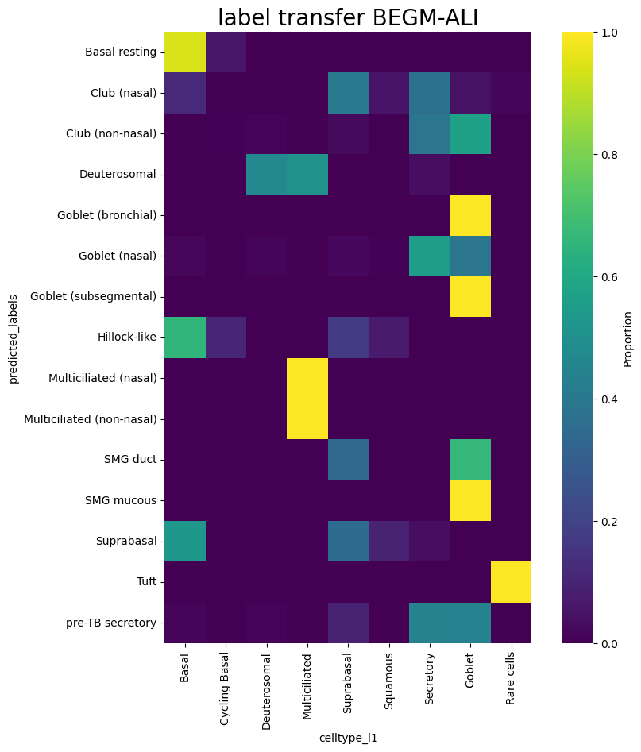

# Single-Cell-Fuzzy-Labels


<!-- WARNING: THIS FILE WAS AUTOGENERATED! DO NOT EDIT! -->


## Install

``` sh
git clone https://github.com/Eamonmca/Single-Cell-Fuzzy-Labels
cd Single-Cell-Fuzzy-Labels
pip install .
```

## How to use

In this notebook, we are demonstrating the use of the
`Single_Cell_Fuzzy_Labels` library. This library is designed to
facilitate the transfer of labels from a well-annotated reference
dataset to a query dataset in single-cell RNA sequencing (scRNA-seq)
studies. The library provides functions for label transfer,
visualization of label transfers, and harmonization of cell labels.

The process begins with the extraction of Universal Cell Embeddings
(UCE) from both the reference and query datasets. The UCE is a
lower-dimensional representation of the datasets that is used for label
transfer.

The `transfer.labels` function is then used to perform the label
transfer. This function takes several parameters including the UCE of
the reference and query datasets, the labels from the reference dataset
that we want to transfer, and the number of nearest neighbors to
consider when transferring labels.

After the label transfer, the `viz` module is used to visualize the
label transfers and the distribution of the transferred labels. This
helps in understanding how well the labels from the reference dataset
map to the cells in the query dataset.

Finally, the `harmonise` module is used to match the cell labels in the
query dataset with those in the reference dataset. This is done by
creating a dictionary that maps each unique label in the query dataset
to a corresponding label in the reference dataset. We leverage the
reasoning capabilitys of GPT-4 to do this using the openAI API.

``` python
from Single_Cell_Fuzzy_Labels import census
import scanpy as sc 
import matplotlib.pyplot as plt
import warnings
from dotenv import load_dotenv
load_dotenv()
warnings.filterwarnings('ignore')
```

In the following section, we will be loading the reference dataset. This
dataset is a pre-embedded data from the cellxgene census, which contains
a vast dataset of 33 million cells. We will be using the ‘homo_sapiens’
organism and ‘lung’ tissue for this example. The data is loaded using
the ‘read_h5ad’ function from the ‘scanpy’ library.

After loading the data, we will subset it to only include ‘Epithelial’
cells. This is done by filtering the ‘ann_level_1’ column of the ‘obs’
attribute of the ‘reference’ object. The subset is then assigned back to
the ‘reference’ object.

We will then display the ‘X_uce’ attribute of the ‘obsm’ attribute of
the ‘reference’ object. This attribute contains the Universal Cell
Embeddings for the ‘reference’ object.

``` python
# reference = census.download_emb(organism='homo_sapiens', tissue='lung', test = True)
reference = sc.read_h5ad('/data/analysis/data_mcandrew/000-sc-UCA-test/uce/HCA_lung_core__uce_adata.h5ad')
```

``` python
reference
```

    AnnData object with n_obs × n_vars = 584944 × 18166
        obs: 'suspension_type', 'donor_id', 'is_primary_data', 'assay_ontology_term_id', 'cell_type_ontology_term_id', 'development_stage_ontology_term_id', 'disease_ontology_term_id', 'self_reported_ethnicity_ontology_term_id', 'tissue_ontology_term_id', 'organism_ontology_term_id', 'sex_ontology_term_id', 'BMI', 'age_or_mean_of_age_range', 'age_range', 'anatomical_region_ccf_score', 'ann_coarse_for_GWAS_and_modeling', 'ann_finest_level', 'ann_level_1', 'ann_level_2', 'ann_level_3', 'ann_level_4', 'ann_level_5', 'cause_of_death', 'dataset', 'entropy_dataset_leiden_3', 'entropy_original_ann_level_1_leiden_3', 'entropy_original_ann_level_2_clean_leiden_3', 'entropy_original_ann_level_3_clean_leiden_3', 'entropy_subject_ID_leiden_3', 'fresh_or_frozen', 'leiden_1', 'leiden_2', 'leiden_3', 'leiden_4', 'leiden_5', 'log10_total_counts', 'lung_condition', 'mixed_ancestry', 'n_genes_detected', 'original_ann_highest_res', 'original_ann_level_1', 'original_ann_level_2', 'original_ann_level_3', 'original_ann_level_4', 'original_ann_level_5', 'original_ann_nonharmonized', 'reannotation_type', 'reference_genome', 'sample', 'scanvi_label', 'sequencing_platform', 'size_factors', 'smoking_status', 'study', 'subject_type', 'tissue_dissociation_protocol', 'tissue_level_2', 'tissue_level_3', 'tissue_sampling_method', 'tissue_type', 'cell_type', 'assay', 'disease', 'organism', 'sex', 'tissue', 'self_reported_ethnicity', 'development_stage', 'observation_joinid', 'n_genes'
        var: 'feature_is_filtered', 'feature_name', 'feature_reference', 'feature_biotype', 'feature_length', 'n_cells'
        uns: 'batch_condition', 'citation', 'default_embedding', 'schema_reference', 'schema_version', 'title'
        obsm: 'X_scanvi_emb', 'X_uce', 'X_umap'
        obsp: 'connectivities', 'distances'

``` python
reference_subset = reference[reference.obs['ann_level_1'] == 'Epithelial']
```

``` python
reference = reference_subset
```

``` python
reference.obsm['X_uce']
```

    ArrayView([[ 0.00750788, -0.04194154,  0.00931572, ...,  0.03899895,
                -0.02080086, -0.01758753],
               [ 0.02603231,  0.03415936, -0.00083805, ...,  0.01040316,
                 0.00231683,  0.07622543],
               [ 0.01907516, -0.03912187,  0.01917193, ...,  0.02607882,
                 0.02887304, -0.00058624],
               ...,
               [ 0.00766119, -0.03144012,  0.00277021, ...,  0.03181685,
                 0.00958184,  0.01409992],
               [-0.0129706 ,  0.04543586, -0.00394633, ..., -0.01092251,
                 0.01244534,  0.01408385],
               [-0.0060271 ,  0.00604395,  0.01479142, ..., -0.00512656,
                -0.01186521,  0.02647699]], dtype=float32)

Now, we will import our query dataset. This dataset has been
preprocessed and the embeddings have been precomputed using the
instructions provided on the Universal Cell Embeddings (UCE) GitHub
page. Next, we will leverage our well-annotated reference dataset to
predict the labels in our query dataset. This process is crucial as it
allows us to infer the cell types in the query dataset based on the
known labels in the reference dataset. This is achieved by comparing the
embeddings of cells in both datasets and assigning the labels from the
nearest neighbors in the reference dataset to the cells in the query
dataset. The Single_Cell_Fuzzy_Labels library provides an efficient and
accurate method for this label transfer process.

``` python
query = sc.read_h5ad('/data/analysis/data_mcandrew/000-sc-UCA-test/uce/HBECS_ALI28_uce_adata.h5ad')
```

``` python
query
```

    AnnData object with n_obs × n_vars = 10224 × 14949
        obs: 'orig.ident', 'nCount_RNA', 'nFeature_RNA', 'nCount_HTO', 'nFeature_HTO', 'HTO_maxID', 'HTO_secondID', 'HTO_margin', 'HTO_classification', 'HTO_classification.global', 'hash.ID', 'percent.mito', 'percent.ribo', 'dropouts', 'nCount_SCT', 'nFeature_SCT', 'SCT_snn_res.0.4', 'seurat_clusters', 'echantillon', 'donor', 'medium', 'sample', 'type', 'batch', 'type_pred', 'type_uncertainty', 'leiden', 'RNA_snn_res.1', 'cluster_l1', 'celltype_l1', 'ident', 'n_genes'
        var: 'n_cells'
        uns: 'X_name'
        obsm: 'SCANVI', 'UMAP', 'X_uce'
        layers: 'logcounts'

``` python
query.obsm['X_uce']
```

    array([[ 0.0045417 , -0.0086563 ,  0.01687446, ...,  0.02272223,
            -0.01826951, -0.01024585],
           [ 0.01364084, -0.00542254,  0.01779299, ...,  0.01887637,
            -0.00538362,  0.00553044],
           [ 0.00350829,  0.01183089,  0.01040006, ...,  0.01037928,
            -0.01872197, -0.01138068],
           ...,
           [-0.00063122, -0.01984753,  0.02148496, ...,  0.00014579,
             0.01573275, -0.00872346],
           [ 0.00331486, -0.00467246, -0.02007541, ...,  0.01982483,
             0.00755446,  0.00302285],
           [-0.00757075,  0.01373623,  0.01243316, ...,  0.03014414,
            -0.01670015, -0.01620588]], dtype=float32)

``` python
from Single_Cell_Fuzzy_Labels import transfer
```

In this step, we perform the label transfer using the ‘transfer.labels’
function from the Single_Cell_Fuzzy_Labels library. This function takes
in the embeddings of the reference and query datasets, the labels of the
reference dataset, and several other parameters to control the label
transfer process. The function uses a nearest neighbors approach to
assign labels from the reference dataset to the query dataset. This is a
crucial step in our analysis as it allows us to infer the cell types in
the query dataset based on the known labels in the reference dataset.

``` python
predicted_labels = transfer.labels(embedding_array_reference=reference.obsm['X_uce'], 
                          embedding_array_query=query.obsm['X_uce'], 
                          reference_labels=reference.obs['ann_finest_level'], 
                          k=1, 
                          use_gpu=True, 
                          batch_size=None, 
                          distance_metric='L2', 
                          label_consensus='centroid_based', 
                          timed=False)
```

``` python
query.obs['predicted_labels'] = predicted_labels
```

``` python
query.obs['celltype_l1'].head(10)
```

    Donor1_ALI28_AAACCTGAGCCACCTG    Suprabasal
    Donor1_ALI28_AAACCTGAGCTCAACT         Basal
    Donor1_ALI28_AAACCTGAGTAAGTAC         Basal
    Donor1_ALI28_AAACCTGCAAACCCAT         Basal
    Donor1_ALI28_AAACCTGGTCCTAGCG     Secretory
    Donor1_ALI28_AAACCTGGTCTCGTTC        Goblet
    Donor1_ALI28_AAACCTGTCATACGGT    Suprabasal
    Donor1_ALI28_AAACCTGTCCATGAGT     Secretory
    Donor1_ALI28_AAACCTGTCCGCGTTT         Basal
    Donor1_ALI28_AAACGGGAGAGTAATC     Secretory
    Name: celltype_l1, dtype: category
    Categories (9, object): ['Basal', 'Cycling Basal', 'Deuterosomal', 'Multiciliated', ..., 'Squamous', 'Secretory', 'Goblet', 'Rare cells']

``` python
predicted_labels[:10]
```

    ['Basal resting',
     'Basal resting',
     'Club (nasal)',
     'Basal resting',
     'Club (non-nasal)',
     'Goblet (nasal)',
     'Club (nasal)',
     'Suprabasal',
     'Basal resting',
     'Club (nasal)']

``` python
from Single_Cell_Fuzzy_Labels import viz
```

``` python
transfers = viz.map_label_transfers(query, 'predicted_labels', 'celltype_l1')
```

``` python
print(transfers.head(10))
```

    celltype_l1               Basal  Cycling Basal  Deuterosomal  Multiciliated  \
    predicted_labels                                                              
    Basal resting          0.823691       0.125148      0.000000       0.001574   
    Club (nasal)           0.100762       0.021675      0.002343       0.000000   
    Club (non-nasal)       0.003484       0.000581      0.002904       0.000000   
    Deuterosomal           0.037838       0.000000      0.621622       0.275676   
    Goblet (bronchial)     0.000000       0.000000      0.000000       0.000000   
    Goblet (nasal)         0.011701       0.000900      0.009901       0.000900   
    Goblet (subsegmental)  0.000000       0.000000      0.000000       0.000000   
    Hillock-like           0.555556       0.157233      0.000000       0.000000   
    Ionocyte               0.200000       0.000000      0.000000       0.000000   
    Multiciliated (nasal)  0.000000       0.000000      0.000000       1.000000   

    celltype_l1            Suprabasal  Squamous  Secretory    Goblet  Rare cells  
    predicted_labels                                                              
    Basal resting            0.027155  0.000394   0.020071  0.001181    0.000787  
    Club (nasal)             0.295841  0.042765   0.473345  0.060340    0.002929  
    Club (non-nasal)         0.035424  0.001161   0.448897  0.505807    0.001742  
    Deuterosomal             0.005405  0.005405   0.048649  0.005405    0.000000  
    Goblet (bronchial)       0.000000  0.000000   0.208333  0.791667    0.000000  
    Goblet (nasal)           0.016202  0.027003   0.549055  0.384338    0.000000  
    Goblet (subsegmental)    0.000000  0.000000   0.000000  1.000000    0.000000  
    Hillock-like             0.174004  0.109015   0.004193  0.000000    0.000000  
    Ionocyte                 0.000000  0.000000   0.800000  0.000000    0.000000  
    Multiciliated (nasal)    0.000000  0.000000   0.000000  0.000000    0.000000  

``` python
transfers
```

<div>
<style scoped>
    .dataframe tbody tr th:only-of-type {
        vertical-align: middle;
    }
&#10;    .dataframe tbody tr th {
        vertical-align: top;
    }
&#10;    .dataframe thead th {
        text-align: right;
    }
</style>

| celltype_l1               | Basal    | Cycling Basal | Deuterosomal | Multiciliated | Suprabasal | Squamous | Secretory | Goblet   | Rare cells |
|---------------------------|----------|---------------|--------------|---------------|------------|----------|-----------|----------|------------|
| predicted_labels          |          |               |              |               |            |          |           |          |            |
| Basal resting             | 0.823691 | 0.125148      | 0.000000     | 0.001574      | 0.027155   | 0.000394 | 0.020071  | 0.001181 | 0.000787   |
| Club (nasal)              | 0.100762 | 0.021675      | 0.002343     | 0.000000      | 0.295841   | 0.042765 | 0.473345  | 0.060340 | 0.002929   |
| Club (non-nasal)          | 0.003484 | 0.000581      | 0.002904     | 0.000000      | 0.035424   | 0.001161 | 0.448897  | 0.505807 | 0.001742   |
| Deuterosomal              | 0.037838 | 0.000000      | 0.621622     | 0.275676      | 0.005405   | 0.005405 | 0.048649  | 0.005405 | 0.000000   |
| Goblet (bronchial)        | 0.000000 | 0.000000      | 0.000000     | 0.000000      | 0.000000   | 0.000000 | 0.208333  | 0.791667 | 0.000000   |
| Goblet (nasal)            | 0.011701 | 0.000900      | 0.009901     | 0.000900      | 0.016202   | 0.027003 | 0.549055  | 0.384338 | 0.000000   |
| Goblet (subsegmental)     | 0.000000 | 0.000000      | 0.000000     | 0.000000      | 0.000000   | 0.000000 | 0.000000  | 1.000000 | 0.000000   |
| Hillock-like              | 0.555556 | 0.157233      | 0.000000     | 0.000000      | 0.174004   | 0.109015 | 0.004193  | 0.000000 | 0.000000   |
| Ionocyte                  | 0.200000 | 0.000000      | 0.000000     | 0.000000      | 0.000000   | 0.000000 | 0.800000  | 0.000000 | 0.000000   |
| Multiciliated (nasal)     | 0.000000 | 0.000000      | 0.000000     | 1.000000      | 0.000000   | 0.000000 | 0.000000  | 0.000000 | 0.000000   |
| Multiciliated (non-nasal) | 0.012500 | 0.000000      | 0.011538     | 0.975962      | 0.000000   | 0.000000 | 0.000000  | 0.000000 | 0.000000   |
| SMG duct                  | 0.000000 | 0.000000      | 0.000000     | 0.000000      | 0.090909   | 0.022727 | 0.681818  | 0.204545 | 0.000000   |
| SMG mucous                | 0.000000 | 0.000000      | 0.000000     | 0.000000      | 0.000000   | 0.000000 | 0.111111  | 0.888889 | 0.000000   |
| Suprabasal                | 0.174881 | 0.087440      | 0.000000     | 0.000000      | 0.577107   | 0.015898 | 0.144674  | 0.000000 | 0.000000   |
| Tuft                      | 0.000000 | 0.000000      | 0.133333     | 0.000000      | 0.000000   | 0.000000 | 0.000000  | 0.000000 | 0.866667   |
| pre-TB secretory          | 0.011348 | 0.002837      | 0.005674     | 0.002837      | 0.080851   | 0.001418 | 0.472340  | 0.411348 | 0.011348   |

</div>

``` python
viz.visualize_label_distribution(transfers, fuzz1_score=None, title='label transfer distribution')
plt.show()
```


In single cell data analysis, a common issue arises when dealing with
annotations such as cell types. Even for identical cells, the annotation
sets may not match perfectly. This discrepancy can be due to various
factors such as differences in annotation methods, different naming
conventions, spelling, different resolotions, groupings of subtypes etc.

Single-Cell-Fuzzy-Labels, provides a solution to this problem. It uses a
fuzzy labeling approach to harmonize the cell type annotations across
different datasets. The library leverages the power of natural language
processing and reasoning capabilities of GPT-4 to match the cell type
labels. It also provides visualization tools to inspect the label
transfers and the distribution of labels.

``` python
from Single_Cell_Fuzzy_Labels import harmonise
```

``` python
Label_alias_dict = harmonise.match_cell_labels(list(query.obs['celltype_l1'].values.unique()), list(query.obs['predicted_labels'].unique()))
```

``` python
query.obs['celltype_l1'].unique()
```

    ['Suprabasal', 'Basal', 'Secretory', 'Goblet', 'Deuterosomal', 'Multiciliated', 'Cycling Basal', 'Squamous', 'Rare cells']
    Categories (9, object): ['Basal', 'Cycling Basal', 'Deuterosomal', 'Multiciliated', ..., 'Squamous', 'Secretory', 'Goblet', 'Rare cells']

``` python
print(query.obs['predicted_labels'].values[:10])
```

    ['Basal resting' 'Basal resting' 'Club (nasal)' 'Basal resting'
     'Club (non-nasal)' 'Goblet (nasal)' 'Club (nasal)' 'Suprabasal'
     'Basal resting' 'Club (nasal)']

``` python
Label_alias_dict
```

    {'Basal resting': 'Basal',
     'Club (nasal)': 'Secretory',
     'Club (non-nasal)': 'Secretory',
     'Goblet (nasal)': 'Goblet',
     'Suprabasal': 'Suprabasal',
     'Deuterosomal': 'Deuterosomal',
     'Multiciliated (non-nasal)': 'Multiciliated',
     'Hillock-like': 'Basal',
     'pre-TB secretory': 'Secretory',
     'SMG mucous': 'Secretory',
     'Tuft': 'Rare cells',
     'Goblet (subsegmental)': 'Goblet',
     'SMG duct': 'Secretory',
     'Ionocyte': 'Rare cells',
     'Multiciliated (nasal)': 'Multiciliated',
     'Goblet (bronchial)': 'Goblet'}

``` python
viz.type_map_graph(Label_alias_dict)
```


In this section, we will utilize the ‘harmonise’ function from the
Single-Cell-Fuzzy-Labels library. This function is designed to address
the common issue in single cell data analysis where identical cells may
have different annotations due to various factors such as differences in
annotation methods. The ‘harmonise’ function uses a fuzzy labeling
approach to match cell type labels across different datasets, thereby
enabling more accurate integration and comparison of single cell
datasets with different annotation schemas.

``` python
query.obs['mapped_predictions'] = harmonise.map_old_labels_to_new(list(query.obs['predicted_labels'].values), Label_alias_dict)
```

Additionally, we will calculate a ‘fuzz_1’ score. This score is a
measure of the effectiveness of our fuzzy labeling approach in matching
cell type labels across different datasets. It will provide us with a
(semi) quantitative assessment of the harmonization process,
complementing our visual analysis.

``` python
fuzz_1 = viz.calculate_fuzz_1(query, reference_label='celltype_l1', predicted_query_label='mapped_predictions')
transfers = viz.map_label_transfers(query, 'mapped_predictions', 'celltype_l1')
viz.visualize_label_distribution(transfers, fuzz1_score=fuzz_1, title='label transfer distribution', proportions_flag = 'md', matched = True)
plt.show()
```


``` python
import matplotlib.pyplot as plt

medium_list = query.obs['medium'].unique().tolist()
for medium in medium_list:
    medium_subset = query[query.obs['medium'] == medium]
    transfers = viz.map_label_transfers(medium_subset, 'predicted_labels', 'celltype_l1')
    viz.visualize_label_distribution(transfers, fuzz1_score=None, title=f'label transfer {medium}')
      
    plt.tight_layout()
    plt.show()
    
    fuzz_1 = viz.calculate_fuzz_1(medium_subset, reference_label='celltype_l1', predicted_query_label='mapped_predictions')
    transfers = viz.map_label_transfers(medium_subset, 'mapped_predictions', 'celltype_l1')
    

    viz.visualize_label_distribution(transfers, fuzz1_score=fuzz_1, title=f'label transfer fuzz_1 {medium}', proportions_flag = 'md', matched = True)
    
    plt.tight_layout()
    plt.show()
```


    <Figure size 640x480 with 0 Axes>


    <Figure size 640x480 with 0 Axes>


    <Figure size 640x480 with 0 Axes>


    <Figure size 640x480 with 0 Axes>


    <Figure size 640x480 with 0 Axes>


    <Figure size 640x480 with 0 Axes>



    <Figure size 640x480 with 0 Axes>


    <Figure size 640x480 with 0 Axes>
